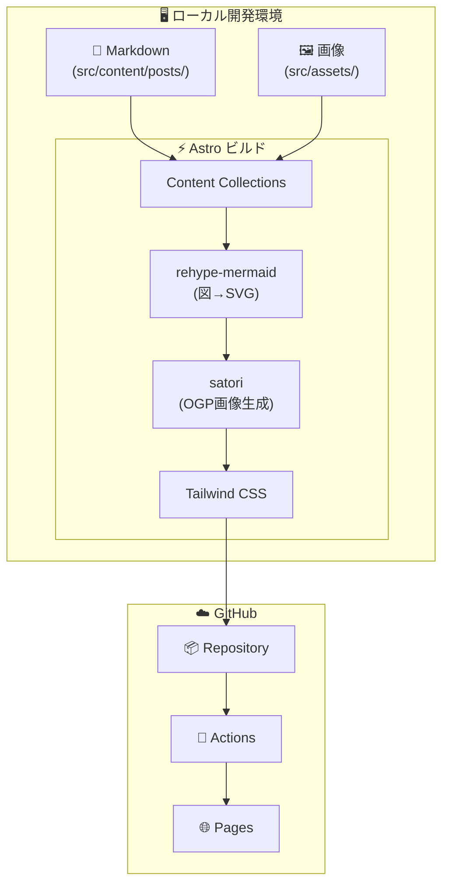
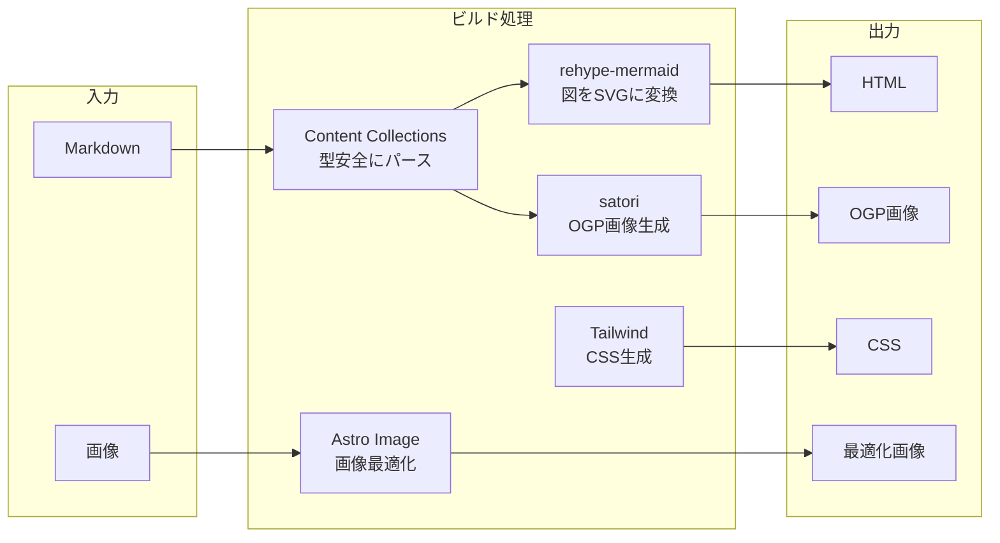

# アーキテクチャ

## 全体構成



---

## 技術スタック

| 層 | 技術 | 役割 |
|----|------|------|
| **フレームワーク** | Astro | 静的サイト生成（SSG） |
| **スタイル** | Tailwind CSS | ユーティリティファーストCSS |
| **図解** | rehype-mermaid | MermaidをビルドTimeでSVG変換 |
| **OGP** | satori | 記事タイトルからOGP画像を自動生成 |
| **ホスティング** | GitHub Pages | 無料の静的ホスティング |
| **CI/CD** | GitHub Actions | 自動ビルド＆デプロイ |

---

## ディレクトリ構成

```
diary-astro/
├── src/
│   ├── assets/              # 画像ファイル（Astroが最適化）
│   │   └── posts/           # 記事ごとの画像
│   │
│   ├── content/
│   │   ├── config.ts        # Content Collections 定義
│   │   └── posts/           # 日記Markdownファイル
│   │
│   ├── layouts/
│   │   └── Base.astro       # 共通レイアウト
│   │
│   ├── pages/
│   │   ├── index.astro      # トップ（記事一覧）
│   │   ├── tags/
│   │   │   └── [tag].astro  # タグ別一覧
│   │   └── posts/
│   │       └── [...slug].astro  # 記事ページ
│   │
│   └── components/
│       ├── Card.astro       # 記事カード（モダンUI）
│       └── Tag.astro        # タグバッジ
│
├── public/
│   └── og/                  # 生成されたOGP画像
│
├── docs/                    # ドキュメント（このファイル含む）
├── astro.config.mjs         # Astro設定
├── tailwind.config.mjs      # Tailwind設定
└── package.json
```

---

## ビルドパイプライン



---

## 主要ライブラリ

```json
{
  "dependencies": {
    "astro": "静的サイト生成",
    "@astrojs/tailwind": "Tailwind統合",
    "rehype-mermaid": "Mermaid→SVG変換",
    "satori": "OGP画像生成",
    "sharp": "画像処理"
  }
}
```
