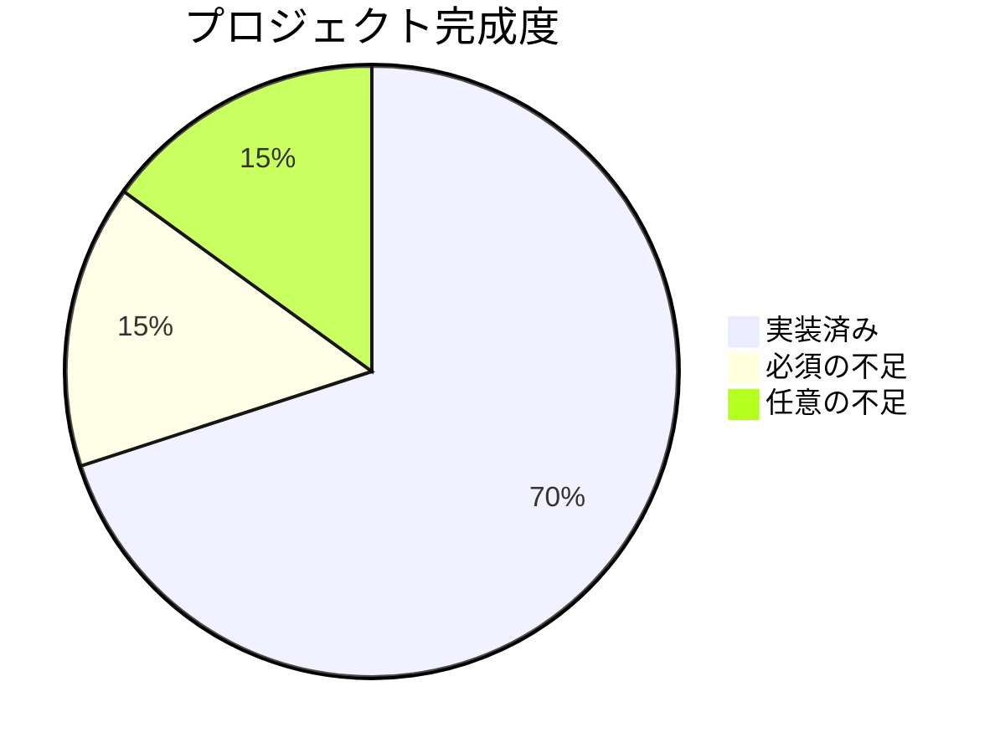
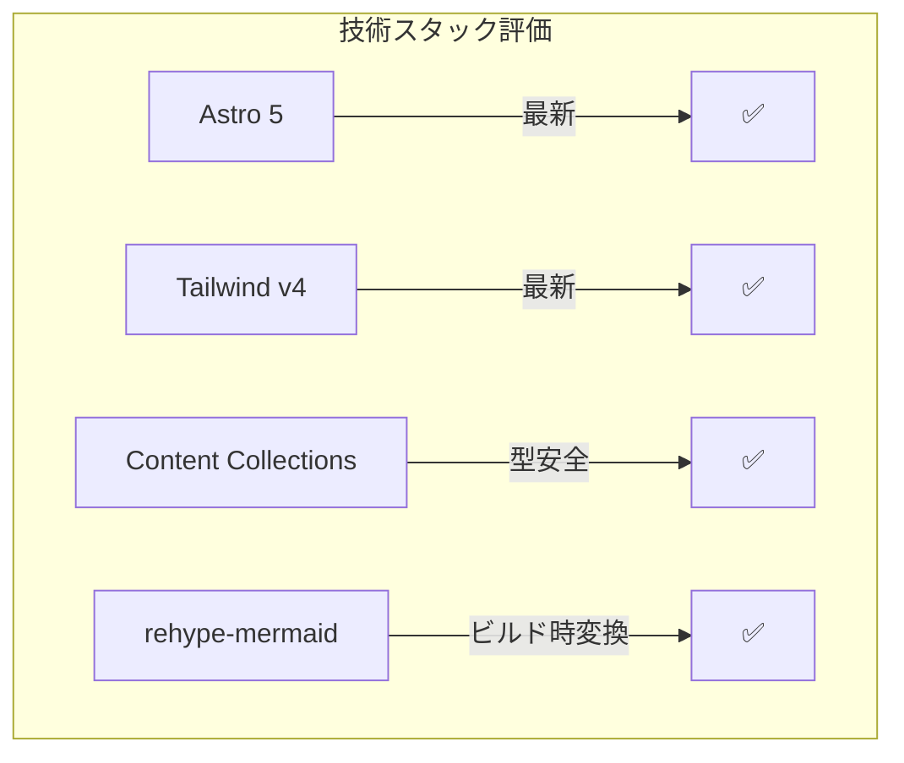
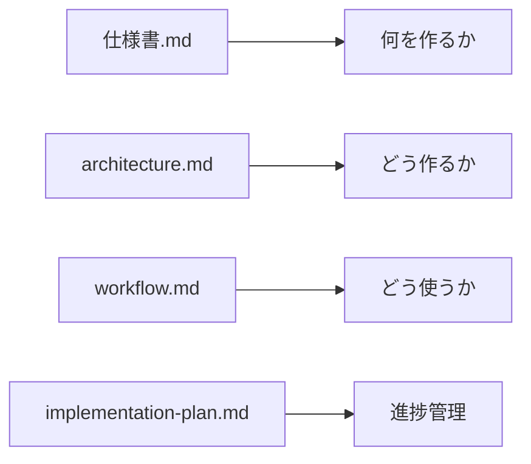
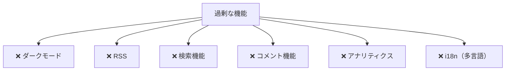
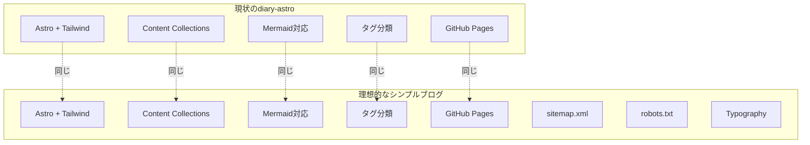
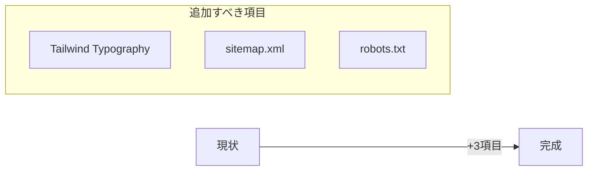

# diary-astro 現状評価レポート

## このドキュメントについて

プロジェクトの現状を客観的に評価し、**良い点**と**不要なもの**を明確にします。
シンプルさを重視する方針に沿って、「やらなくて良いこと」も記載しています。

---

## 現状の評価サマリー



---

## ✅ 良くできている点

### 1. 技術選定が適切



| 技術 | 評価 | 理由 |
|------|------|------|
| Astro 5 | ⭐⭐⭐ | 最新版、コンテンツファーストで適切 |
| Tailwind v4 | ⭐⭐⭐ | 最新版、CSS-in-JS不要でシンプル |
| Content Collections | ⭐⭐⭐ | 型安全、Zodスキーマで堅牢 |
| rehype-mermaid | ⭐⭐⭐ | ビルド時変換でクライアントJS不要 |
| GitHub Pages | ⭐⭐⭐ | 無料、Git連携、シンプル |

---

### 2. ディレクトリ構成がシンプル

```
src/
├── components/     # 2ファイルのみ（Card, Tag）
├── content/        # posts のみ
├── layouts/        # 1ファイルのみ（Base）
├── pages/          # 最小限のルーティング
└── styles/         # 1行のみ
```

**良い点**
- コンポーネントが最小限（2つ）
- レイアウトが1つのみ
- 不要な抽象化がない

---

### 3. コードが読みやすい

**Card.astro の例**
```astro
// Props が明確に型定義されている
interface Props {
  title: string;
  date: Date;
  tags: string[];
  description?: string;
  href: string;
}
```

- TypeScript の interface で Props が明確
- コンポーネントの責務が単一
- 過度な汎用化がない

---

### 4. ドキュメントが充実



- 目的別に分離されている
- Mermaid図で視覚的に理解しやすい
- 後から見ても意図がわかる

---

### 5. CI/CD が正しく設定済み

`.github/workflows/deploy.yml` が Astro 公式推奨の形式で設定されている。

---

## ⛔ やらなくて良いこと

シンプルさを保つため、以下は**実装しない方が良い**項目です。



### 不要な理由

| 機能 | 不要な理由 |
|------|------------|
| ダークモード | 仕様書で「ライトのみ」と明記 |
| RSS | 仕様書で「なし」と明記。個人日記なので購読需要が低い |
| 検索機能 | 仕様書で「なし」と明記。タグで十分 |
| コメント機能 | 個人日記なので不要。運用コストも増える |
| アナリティクス | シンプルさ重視。必要なら後から追加可能 |
| i18n | 日本語のみで十分 |
| PWA対応 | オフライン閲覧の需要がない |
| 関連記事表示 | 記事数が少ないうちは不要 |

---

## 現状 vs 理想の比較



**差分は3つだけ**
1. sitemap.xml
2. robots.txt
3. Tailwind Typography

---

## 結論

### 現状の評価

| 観点 | 評価 | コメント |
|------|------|----------|
| シンプルさ | ⭐⭐⭐⭐⭐ | 過度な抽象化がなく、読みやすい |
| 技術選定 | ⭐⭐⭐⭐⭐ | 最新かつ適切な技術スタック |
| ドキュメント | ⭐⭐⭐⭐⭐ | 充実しており、図解も豊富 |
| SEO対応 | ⭐⭐⭐☆☆ | sitemap/robots.txt が不足 |
| 見た目 | ⭐⭐⭐☆☆ | Typography がないと Markdown が素朴 |

### 最終的な推奨



**3つ追加するだけで、シンプルかつベストプラクティスに沿ったブログが完成します。**

---

## 補足：AstroPaper との比較

人気のミニマルテーマ「AstroPaper」と比較しても、現状の構成は遜色ありません。

| 機能 | AstroPaper | diary-astro | 評価 |
|------|------------|-------------|------|
| Content Collections | ✅ | ✅ | 同等 |
| Tailwind CSS | ✅ | ✅ | 同等 |
| タグ機能 | ✅ | ✅ | 同等 |
| Mermaid | ❌ | ✅ | **優位** |
| sitemap | ✅ | ❌ | 追加推奨 |
| robots.txt | ✅ | ❌ | 追加推奨 |
| Typography | ✅ | ❌ | 追加推奨 |
| ダークモード | ✅ | ❌ | 不要（方針通り） |
| 検索 | ✅ | ❌ | 不要（方針通り） |
| RSS | ✅ | ❌ | 不要（方針通り） |

**結論：必要な機能だけを持ち、Mermaid対応で優位性がある構成になっています。**
