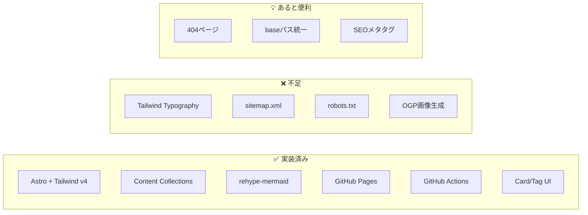
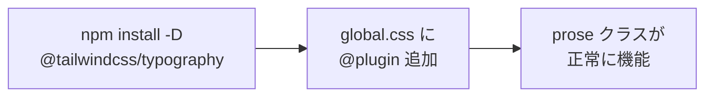
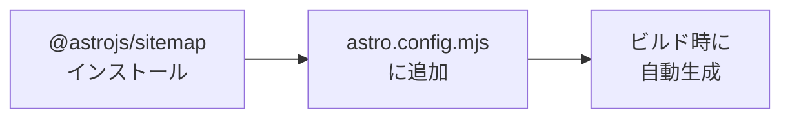
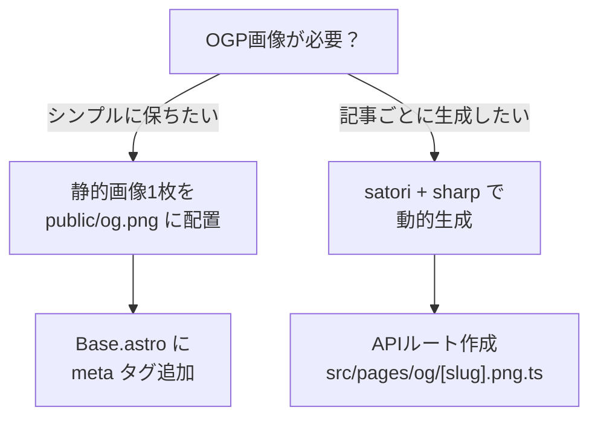

# diary-astro 改善フィードバック

## 概要

現在の構成を調査し、理想的なAstroブログのベストプラクティスと比較分析しました。
**シンプルさを最優先**に、本当に必要な改善点のみをまとめています。

---

## 現在の構成評価



---

## 改善点の優先度マトリックス

| 優先度 | 項目 | 理由 | 工数 |
|--------|------|------|------|
| 🔴 高 | Tailwind Typography | prose クラスが機能していない | 小 |
| 🔴 高 | sitemap.xml | SEO必須、検索エンジン登録に必要 | 小 |
| 🟡 中 | robots.txt | SEO基本、クローラーへの指示 | 極小 |
| 🟡 中 | OGP画像生成 | 仕様書にあり、SNSシェア時に有効 | 中 |
| 🟢 低 | 404ページ | UX向上、なくても動作する | 小 |
| 🟢 低 | baseパス統一 | GitHub Pagesで正常動作するため | 小 |

---

## 🔴 優先度：高

### 1. Tailwind Typography プラグインの追加

**現状の問題**
`src/pages/posts/[...slug].astro` で `prose` クラスを使用しているが、
`@tailwindcss/typography` プラグインが未インストールのため、スタイルが適用されない。

```astro
<!-- 現在のコード（機能していない） -->
<div class="prose prose-gray max-w-none">
  <Content />
</div>
```

**解決方法**



**手順**

1. パッケージをインストール
```bash
npm install -D @tailwindcss/typography
```

2. `src/styles/global.css` を更新
```css
@import "tailwindcss";
@plugin "@tailwindcss/typography";
```

---

### 2. sitemap.xml の追加

**なぜ必要か**
- Google/Bing などの検索エンジンがサイト構造を把握するために必須
- Search Console への登録時に必要

**解決方法**



**手順**

1. パッケージをインストール
```bash
npx astro add sitemap
```

2. `astro.config.mjs` に追加（自動で追加される）
```javascript
import sitemap from '@astrojs/sitemap';

export default defineConfig({
  site: 'https://siotomo.github.io',
  base: '/diary-astro',
  integrations: [sitemap()],
  // ... 他の設定
});
```

---

## 🟡 優先度：中

### 3. robots.txt の追加

**なぜ必要か**
クローラーに対してサイトのクロール可否を指示する標準ファイル。

**手順**
`public/robots.txt` を作成：

```txt
User-agent: *
Allow: /

Sitemap: https://siotomo.github.io/diary-astro/sitemap-index.xml
```

---

### 4. OGP画像自動生成（satori）

**現状**
仕様書に記載があるが未実装。SNSでシェアした際のプレビュー画像が表示されない。

**実装の複雑さ**
satori + sharp の組み合わせは設定がやや複雑なため、以下の選択肢を提案：



**シンプルな方法（推奨）**

1. `public/og.png` にデフォルトOGP画像を配置
2. `src/layouts/Base.astro` に以下を追加：

```astro
<head>
  <!-- 既存のメタタグ -->

  <!-- OGP -->
  <meta property="og:title" content={title} />
  <meta property="og:description" content={description} />
  <meta property="og:type" content="article" />
  <meta property="og:image" content={`${import.meta.env.SITE}${import.meta.env.BASE_URL}og.png`} />

  <!-- Twitter Card -->
  <meta name="twitter:card" content="summary_large_image" />
</head>
```

---

## 🟢 優先度：低

### 5. 404ページの追加

**手順**
`src/pages/404.astro` を作成：

```astro
---
import Base from '../layouts/Base.astro';
---

<Base title="ページが見つかりません">
  <div class="text-center py-16">
    <h1 class="text-6xl font-bold text-gray-300 mb-4">404</h1>
    <p class="text-gray-600 mb-8">お探しのページは見つかりませんでした。</p>
    <a href="/" class="text-blue-600 hover:text-blue-800">
      ← トップページに戻る
    </a>
  </div>
</Base>
```

---

### 6. baseパスの統一

**現状の問題**
`index.astro` で記事リンクに `base` パスが含まれていない：

```astro
<!-- 現在 -->
href={`/posts/${post.id}`}

<!-- GitHub Pages で正しく動作させるには -->
href={`${import.meta.env.BASE_URL}posts/${post.id}`}
```

**影響箇所**
- `src/pages/index.astro`
- `src/components/Card.astro`
- `src/pages/tags/[tag].astro`
- `src/pages/posts/[...slug].astro`
- `src/layouts/Base.astro`（ヘッダーのリンク）

---

## 実装ロードマップ

```mermaid
gantt
    title 改善実装の推奨順序
    dateFormat X
    axisFormat %s

    section 必須
    Tailwind Typography    :a1, 0, 1
    sitemap.xml           :a2, 1, 2

    section 推奨
    robots.txt            :b1, 2, 3
    OGP（シンプル版）      :b2, 3, 4

    section 任意
    baseパス統一          :c1, 4, 5
    404ページ             :c2, 5, 6
```



---

## まとめ

### すぐに対応すべき項目（工数：小）

1. **Tailwind Typography** - Markdown表示の見た目を大幅改善
2. **sitemap.xml** - SEO必須、コマンド1つで追加可能
3. **robots.txt** - ファイル1つ追加するだけ

### 余裕があれば対応する項目

4. **OGP画像** - SNSシェア時の見栄え向上
5. **404ページ** - UX向上
6. **baseパス統一** - GitHub Pages での完全動作保証

---

## 参考情報

- [Astro 公式ドキュメント - Sitemap](https://docs.astro.build/en/guides/integrations-guide/sitemap/)
- [Astro 公式ドキュメント - Tailwind Typography](https://docs.astro.build/en/recipes/tailwind-rendered-markdown/)
- [Astro SEO ベストプラクティス](https://dev.to/cookieduster_n/seo-for-astro-how-to-make-the-fastest-framework-also-the-smartest-501o)
- [GitHub Pages デプロイガイド](https://docs.astro.build/en/guides/deploy/github/)
