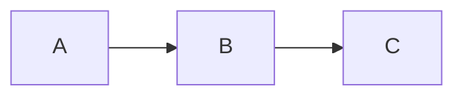
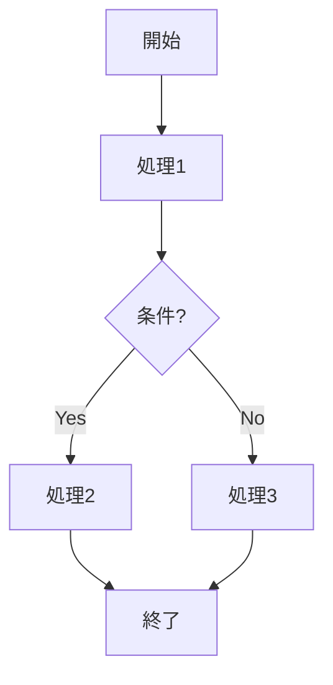
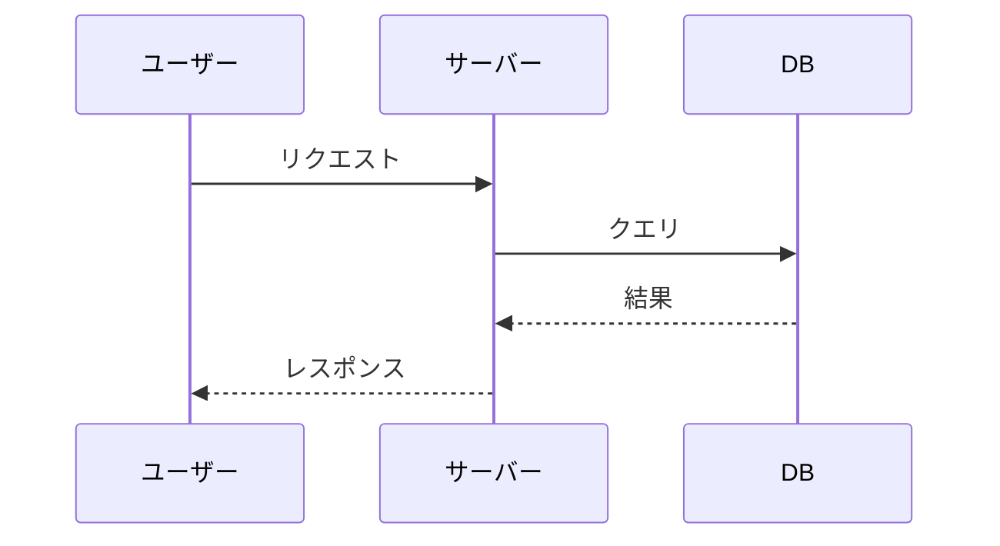
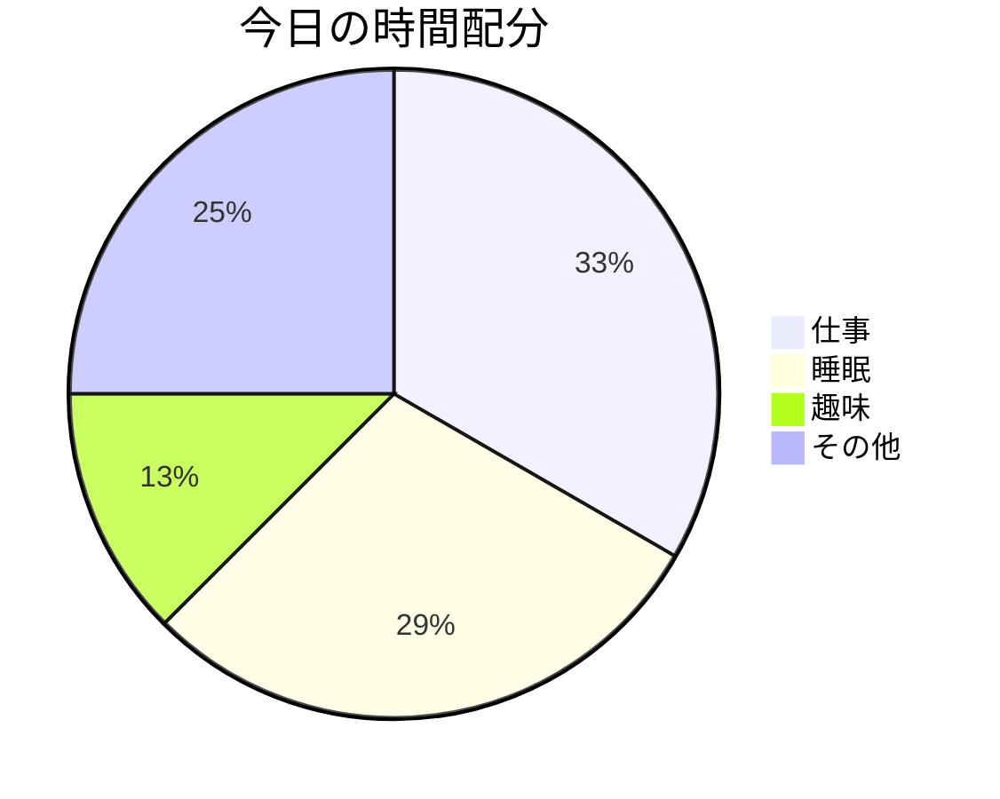

# diary-astro 使い方チュートリアル

このドキュメントでは、diary-astroの基本的な使い方を説明します。

---

## 1. 開発環境の起動

### ローカルサーバーを起動する

```bash
npm run dev
```

起動すると以下のURLでアクセスできます：

```
http://localhost:4321/diary-astro/
```

> **ポイント**: `/diary-astro/` というパスが必要です（GitHub Pages用の設定）

### 確認すること

- [ ] トップページに記事一覧が表示される
- [ ] 記事カードをクリックすると詳細ページへ遷移
- [ ] タグをクリックするとタグ別一覧ページへ遷移

---

## 2. 新しい記事を書く

### ファイルを作成

```bash
# 日付-タイトル.md の形式で作成
touch src/content/posts/2025-01-16-my-new-post.md
```

### frontmatter（記事情報）を書く

ファイルの先頭に以下を記述：

```yaml
---
title: "記事のタイトル"
date: 2025-01-16
tags: ["日記", "技術"]
description: "記事の概要（OGP用、省略可）"
---
```

| 項目 | 必須 | 説明 |
|------|------|------|
| `title` | ✅ | 記事のタイトル |
| `date` | ✅ | 公開日（YYYY-MM-DD形式） |
| `tags` | ❌ | タグの配列（省略時は空配列） |
| `description` | ❌ | OGP用の説明文 |

### 本文を書く

frontmatterの後にMarkdownで本文を書きます：

```markdown
---
title: "今日の出来事"
date: 2025-01-16
tags: ["日記"]
---

## 見出し

本文を書きます。**太字**や*斜体*も使えます。

### リスト

- 項目1
- 項目2
- 項目3

### コードブロック

\`\`\`javascript
const hello = "world";
console.log(hello);
\`\`\`
```

---

## 3. Mermaid図を使う

### 基本的な書き方

コードブロックで `mermaid` を指定：

````markdown

````

### よく使う図の例

#### フローチャート

````markdown

````

#### シーケンス図

````markdown

````

#### 円グラフ

````markdown

````

> **注意**: Mermaid図はビルド時にSVGに変換されます。`npm run dev` で確認できます。

---

## 4. 画像を使う

### 画像の配置場所

```
src/assets/posts/YYYY-MM-DD/
```

例：

```
src/assets/posts/2025-01-16/
├── photo1.jpg
└── screenshot.png
```

### 記事内での参照

```markdown

```

---

## 5. プレビューと公開

### ローカルでプレビュー

```bash
npm run dev
# → http://localhost:4321/diary-astro/ で確認
```

### ビルドテスト

```bash
npm run build
# エラーがなければOK
```

### 公開

```bash
git add .
git commit -m "post: 記事タイトル"
git push
```

pushすると：
1. GitHub Actionsが自動でビルド
2. 約2〜3分でGitHub Pagesに反映
3. https://siotomo.github.io/diary-astro/ で確認

---

## 6. よく使うコマンド一覧

| コマンド | 説明 |
|----------|------|
| `npm run dev` | 開発サーバー起動 |
| `npm run build` | 本番ビルド |
| `npm run preview` | ビルド結果をプレビュー |
| `git status` | 変更ファイルを確認 |
| `git add .` | 全ファイルをステージング |
| `git commit -m "メッセージ"` | コミット作成 |
| `git push` | GitHubにプッシュ（自動デプロイ） |

---

## 7. トラブルシューティング

### ビルドエラーが出る

```bash
# 依存関係を再インストール
rm -rf node_modules
npm install
```

### Mermaid図が表示されない

- コードブロックの言語指定が `mermaid` になっているか確認
- 構文エラーがないか確認（[Mermaid Live Editor](https://mermaid.live/) で検証可能）

### 変更が反映されない

```bash
# キャッシュをクリアして再ビルド
rm -rf dist .astro
npm run build
```

---

## 8. 公開URL

| ページ | URL |
|--------|-----|
| トップページ | https://siotomo.github.io/diary-astro/ |
| 記事ページ | https://siotomo.github.io/diary-astro/posts/YYYY-MM-DD-title/ |
| タグページ | https://siotomo.github.io/diary-astro/tags/タグ名/ |
