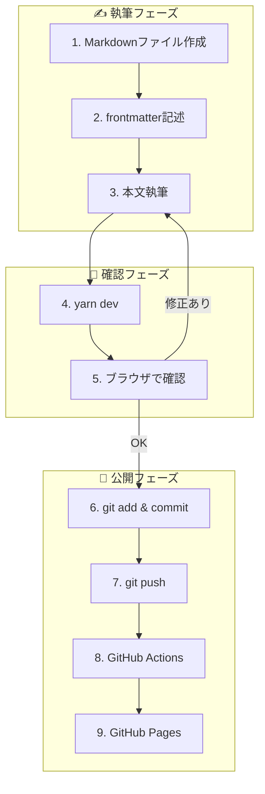
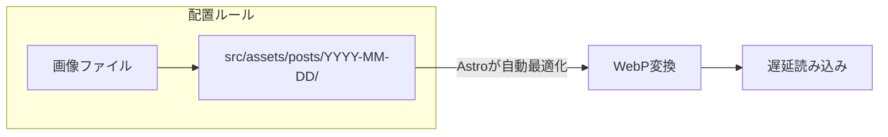

# 運用フロー

## 記事公開の流れ



---

## ステップ詳細

### 1. Markdownファイル作成

```bash
# ファイル名は日付ベース
touch src/content/posts/2025-01-15-title.md
```

### 2. frontmatter記述

```yaml
---
title: "記事タイトル"
date: 2025-01-15
tags: ["日常", "技術"]
description: "記事の概要（OGP用）"
---
```

### 3. 本文執筆

```markdown
## 見出し

本文テキスト...

### 画像の挿入


### Mermaid図の挿入

\`\`\`mermaid
flowchart LR
    A --> B --> C
\`\`\`
```

### 4-5. ローカル確認

```bash
yarn dev
# → http://localhost:4321 で確認
```

### 6-7. 公開

```bash
git add .
git commit -m "post: 記事タイトル"
git push
```

---

## 画像の配置ルール



| 種類 | 配置場所 | 例 |
|------|----------|-----|
| 記事画像 | `src/assets/posts/YYYY-MM-DD/` | `src/assets/posts/2025-01-15/photo.jpg` |
| サイト共通 | `public/` | `public/favicon.ico` |

---

## よく使うコマンド

| コマンド | 用途 |
|----------|------|
| `yarn dev` | 開発サーバー起動 |
| `yarn build` | 本番ビルド |
| `yarn preview` | ビルド結果確認 |

---

## Git コミットメッセージ規約

| prefix | 用途 | 例 |
|--------|------|-----|
| `post:` | 新規記事 | `post: 今日の出来事` |
| `fix:` | 記事修正 | `fix: タイポ修正` |
| `style:` | デザイン変更 | `style: カードUIの余白調整` |
| `chore:` | 設定変更 | `chore: Astroバージョン更新` |
