## はじめに

これは **diary-astro** の最初の記事です。

### 機能テスト

- Markdownが正しくレンダリングされるか
- Tailwind CSSが適用されるか
- Content Collectionsが動作するか
- Mermaid図が表示されるか

### Mermaid図のテスト

```mermaid
flowchart LR
    A["📝 記事作成"] --> B["👀 確認"]
    B --> C["🚀 公開"]
```



### コードブロック

```typescript
const message = "Hello, diary-astro!";
console.log(message);
```

### 今後の予定

1. ~~Mermaid対応~~ ✅
2. OGP画像自動生成
3. GitHub Pages公開
