このページでは、様々な種類のMermaid図が正しく表示されるかをテストします。

---

## 1. フローチャート（flowchart）

### 基本的なフロー

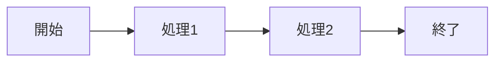

### 分岐あり

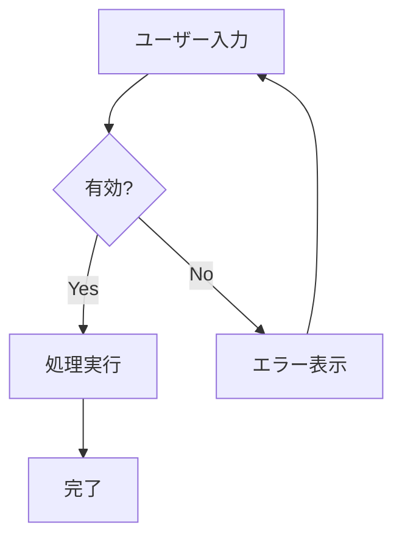

### サブグラフ

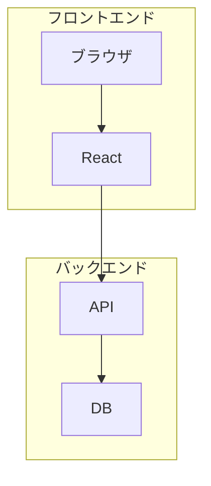

---

## 2. シーケンス図（sequence）

### 基本

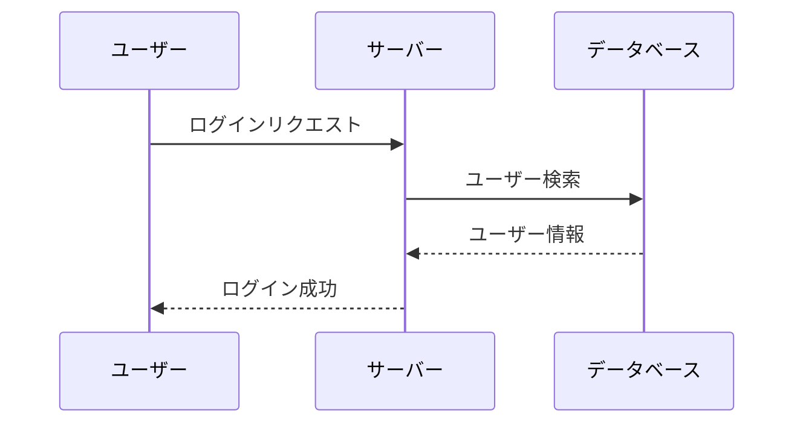

### ループと条件分岐

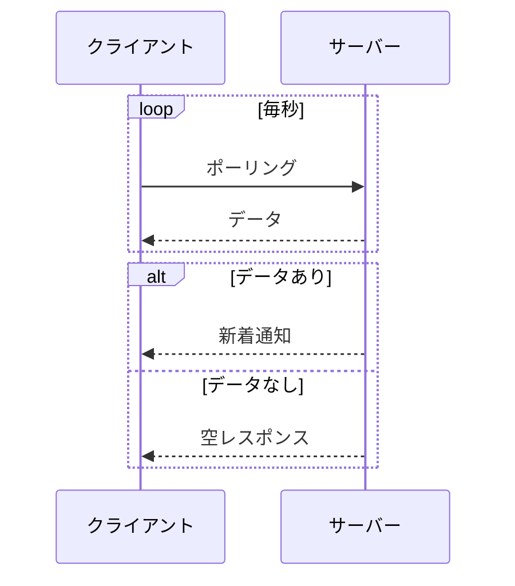

---

## 3. クラス図（classDiagram）

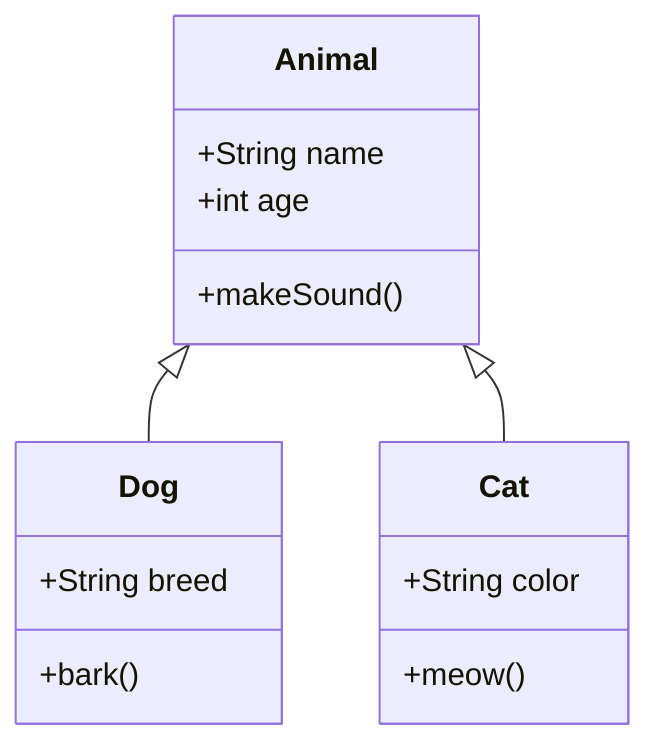

---

## 4. 状態遷移図（stateDiagram）

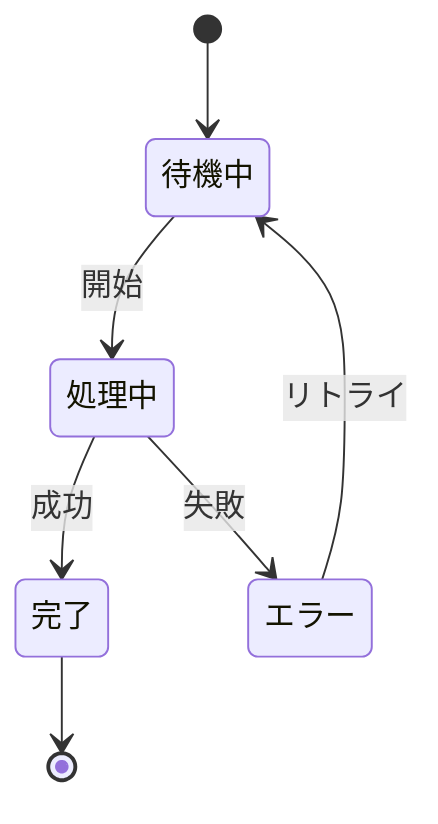

---

## 5. ER図（erDiagram）

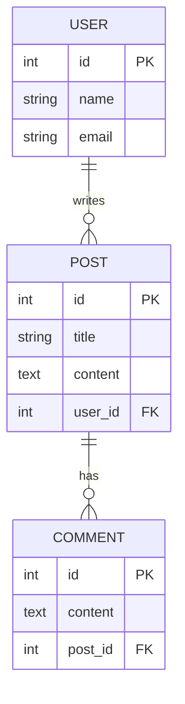

---

## 6. 円グラフ（pie）

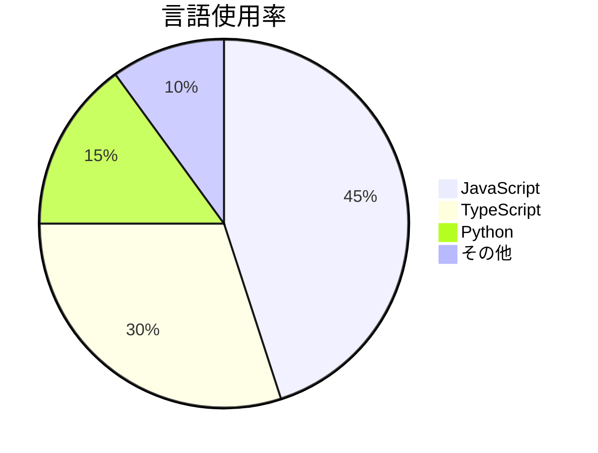

---

## 7. ガントチャート（gantt）

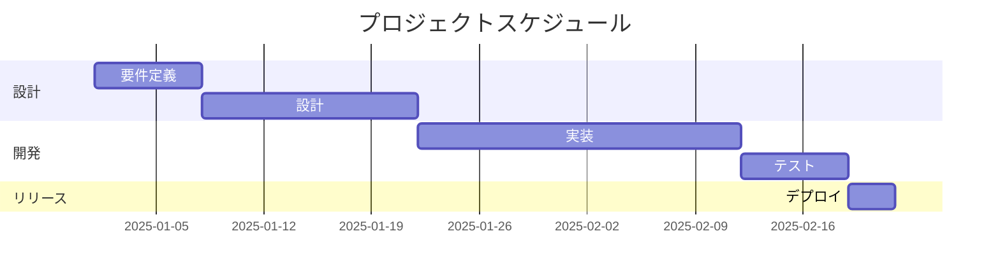

---

## 8. Git グラフ（gitGraph）

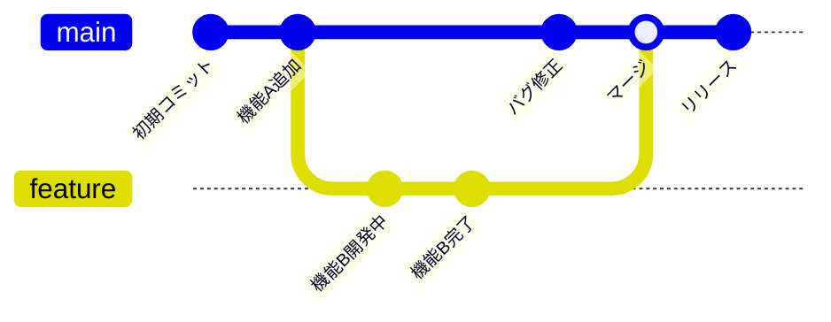

---

## 9. マインドマップ（mindmap）

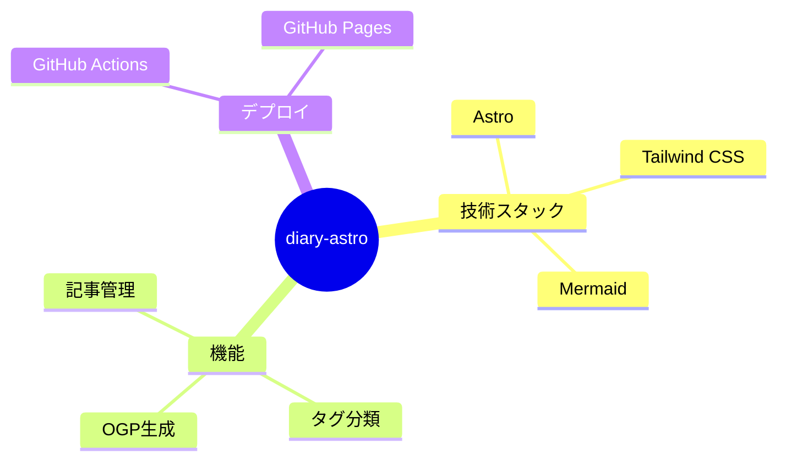

---

## 10. タイムライン（timeline）

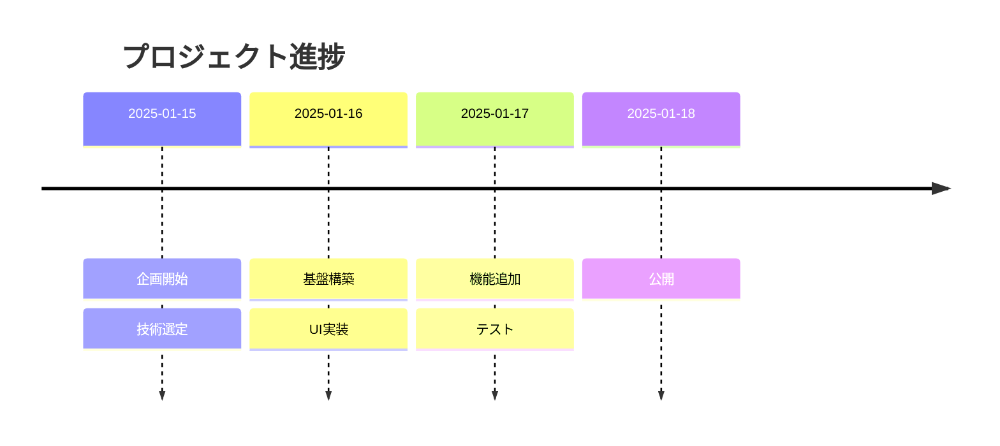

---

## まとめ

上記のMermaid図がすべて正しくSVGとして表示されていれば、rehype-mermaidの設定は正常に動作しています。

もし表示されない図があれば、以下を確認してください：

1. Mermaidの構文エラー
2. rehype-mermaidのバージョン
3. Playwrightのインストール状態
