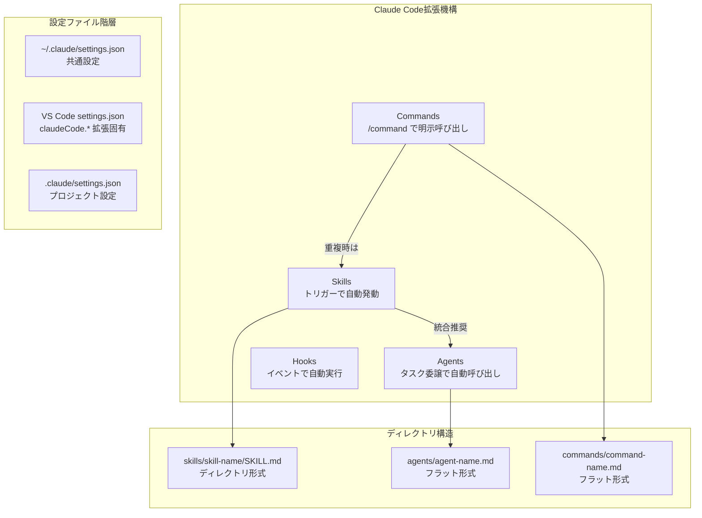
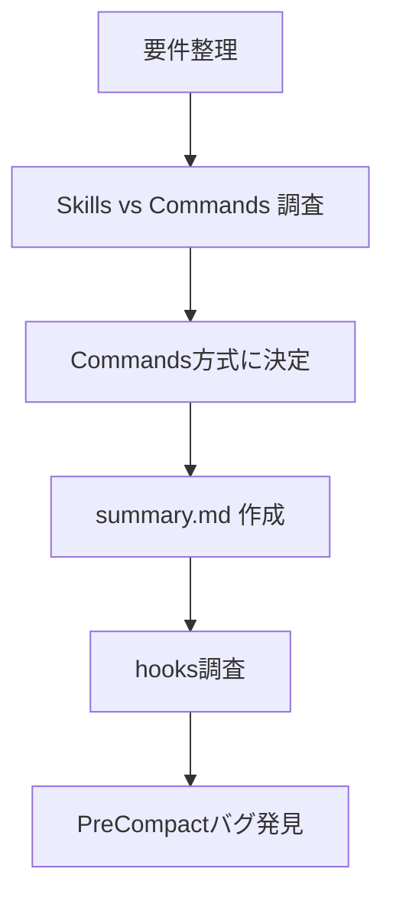
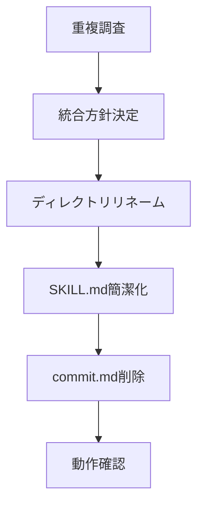
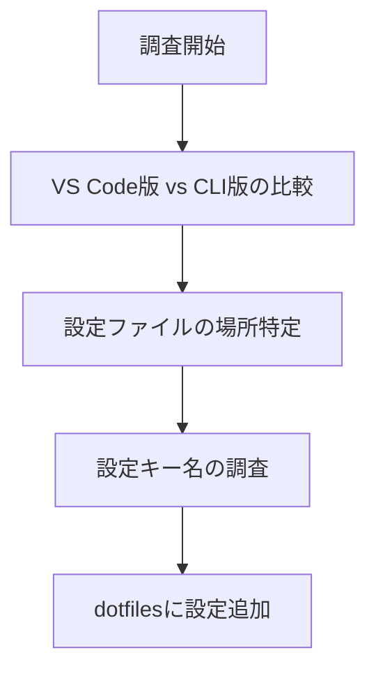
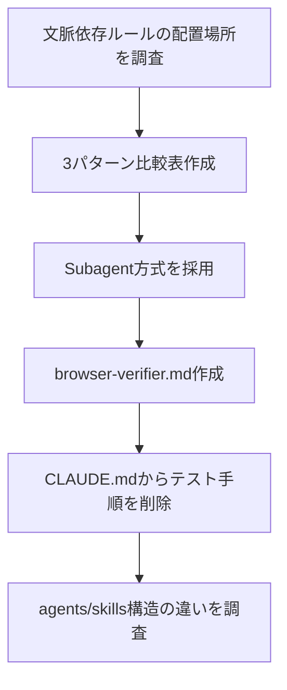

# Daily Learning Digest: 2026-01-09

---

## Overview

### Today's Sessions
1. [/summary コマンドの作成](#session-1-summary-コマンドの作成) - 作業記録用コマンドの新設とHooks調査
2. [commit スキルの統合・簡素化](#session-2-commit-スキルの統合簡素化) - 重複していたスキル/コマンドを1つに統合
3. [VS Code版 Claude Code 設定調査](#session-3-vs-code版-claude-code-設定調査) - VS Code拡張とCLIの違いを把握
4. [Agents と Skills のディレクトリ構造の違い](#session-4-agents-と-skills-のディレクトリ構造の違い) - 文脈依存ルールの配置方法を調査

### Concepts Covered（統合マップ）



- **Commands → Skills**: 機能が似ているが、Skillsは自動トリガー対応で高機能。重複時はSkillsに統合
- **Skills → Agents**: Skillsは「ワークフロー/手順書」、Agentsは「専門家の人格」
- **Skills構造**: ディレクトリ形式（複数ファイル可）、Agents/Commands: フラット形式（単一ファイル）
- **設定ファイル**: `~/.claude/settings.json`（共通）と VS Code `settings.json`（拡張固有）の2層構造

### Decisions Made

| セッション | 選択 | 理由 |
|------------|------|------|
| /summary作成 | Commands方式 | 明示的に呼び出すユースケースのため |
| commit統合 | Skills方式に統一 | 自動トリガー対応で高機能、重複解消 |
| VS Code設定 | ハイブリッド運用 | VS Codeの利便性 + CLIのフル機能を両立 |
| 管理画面テスト手順 | Subagent方式 | 単一ファイルで完結、descriptionマッチで自動適用 |

---

## Session Details

### Session 1: /summary コマンドの作成

#### 目的・背景

**なぜこの作業をしたか**
- Claude Codeでの作業を後から振り返りにくい
- 細かいタスクが多く、何をしたか忘れてしまう
- レビュー時に作業内容を思い出すのが大変

**達成したいこと**
- 作業内容をMarkdownファイルとして保存
- 図解付きで見やすく
- `/summary` で簡単に呼び出せる

#### やったこと



**Step 1: 要件整理**
- 保存先: `~/dotfiles/claude/sessions/`
- 対象: タスク単位（セッション全体ではない）
- 内容: 目的・背景、やったこと（図解付き）、学び・注意点

**Step 2: Skills vs Commands の調査**
- Skills: フレーズで自動トリガー（例: 「コミットして」）
- Commands: 明示的に `/command-name` で呼び出し
- **結論**: `/summary` は明示的に呼び出すので Commands が適切

**Step 3: summary.md の作成**
- `/Users/shiomi/dotfiles/claude/commands/summary.md` を作成
- テンプレート構造、命名規則、実行手順を定義

**Step 4: hooks機能の調査**
- `/compact` 実行前に `/summary` を自動実行できないか調査
- `PreCompact` hookイベントが存在することを発見

#### 学び・注意点

**Claude Code Commands vs Skills**

| 項目 | Commands | Skills |
|------|----------|--------|
| 呼び出し | `/command-name` で明示的 | フレーズで自動トリガー |
| 場所 | `commands/*.md` | `skills/<name>/SKILL.md` |
| 用途 | 明確なアクション | 会話中の自然な補助 |

**Claude Code Hooks 機能**

設定場所:
- `~/.claude/settings.json` - ユーザー設定（全プロジェクト共通）
- `.claude/settings.json` - プロジェクト設定
- `.claude/settings.local.json` - ローカル設定

利用可能なイベント:

| イベント | タイミング |
|---------|-----------|
| SessionStart | セッション開始時 |
| UserPromptSubmit | プロンプト送信直後 |
| PreToolUse | ツール実行前 |
| PostToolUse | ツール実行後 |
| PreCompact | compact実行前 |
| Stop | 応答終了時 |

設定例（自動フォーマット）:
```json
{
  "hooks": {
    "PostToolUse": [
      {
        "matcher": "Edit|Write",
        "hooks": [
          {
            "type": "command",
            "command": "prettier --write $CLAUDE_FILE_PATHS"
          }
        ]
      }
    ]
  }
}
```

**次回への注意点**
- **PreCompact hookにバグあり** - GitHub Issue #13572 によると、`/compact` 実行時に PreCompact hook が発火しない問題が報告されている（2025年12月時点）
- hooks はシェルコマンドを実行するもので、Claude Code のスラッシュコマンドを直接呼び出すのは難しい
- `/compact` 前に自動で `/summary` を実行したい場合は、バグ修正を待つか、手動で実行する習慣をつける

**参考リソース**
- [claude-code-hooks-mastery](https://github.com/disler/claude-code-hooks-mastery) - 全8 hookイベントの実装例
- [GitHub Issue #13572](https://github.com/anthropics/claude-code/issues/13572) - PreCompact hook バグ報告

---

### Session 2: commit スキルの統合・簡素化

#### 目的・背景

**なぜこの作業をしたか**
- `commit-helper`（スキル）と `commit`（コマンド）の2つが存在し、内容がほぼ重複していた
- どちらを使うべきか分かりにくくなっていた

**達成したいこと**
- 1つに統合して管理を簡素化
- 分量を最小限にしつつ、動作は維持

#### やったこと



**Step 1: 重複調査**
- `skills/commit-helper/SKILL.md`（74行）
- `commands/commit.md`（69行）
- 公式プラグインの`commit.md`（18行、別物）

→ 前2つがほぼ同じ内容で重複

**Step 2: 統合方針決定**
- `/commit` の方が短くて使いやすいのでスキル名を `commit` に統一
- `commands/commit.md` を削除

**Step 3: 実施**
- `skills/commit-helper/` → `skills/commit/` にリネーム
- SKILL.md の `name` を `commit` に変更
- 内容を74行→31行に簡潔化（冗長なプレフィックス・説明を削除）
- `commands/commit.md` を削除

**Step 4: 動作確認**
- `/commit` スキルが正常に動作することを確認
- 自動トリガー（「コミットして」等）も有効

#### 学び・注意点

**学んだこと**
- スキル（skills/）とコマンド（commands/）は機能が似ているが、スキルの方が自動トリガー対応で高機能
- 重複を避けるには、スキルに統一した方がシンプル

**次回への注意点**
- 新機能追加時は、既存のスキル/コマンドとの重複がないか先に確認する

---

### Session 3: VS Code版 Claude Code 設定調査

#### 目的・背景

**なぜこの作業をしたか**
- VS Code版とターミナル版Claude Codeの違いを理解したかった
- VS Code固有の設定がどこに保存されるか確認したかった
- dotfilesでClaude Code設定を管理したかった

**達成したいこと**
- 両バージョンの機能差を把握
- VS Code設定をdotfilesで一元管理

#### やったこと



**Step 1: VS Code版 vs ターミナル版の比較調査**

| 機能 | VS Code Extension | ターミナル (CLI) |
|------|:-----------------:|:----------------:|
| グラフィカルUI | ✅ | ❌ |
| インラインdiff表示 | ✅ | ❌ |
| 全Slash Commands (350+) | ❌ 一部のみ | ✅ |
| Tab補完 | ❌ | ✅ |
| Checkpoints | ❌ | ✅ |
| MCP Server設定 | CLI経由で設定 | ✅ 直接設定 |

**Step 2: 設定ファイルの場所特定**

2種類の設定ファイルが存在:

| ファイル | 役割 |
|---------|------|
| `~/Library/Application Support/Code/User/settings.json` | VS Code Extension固有の設定 |
| `~/.claude/settings.json` | CLI/Extension共通（permissions, hooks, MCP等） |

**Step 3: VS Code固有の設定キー調査**

主な設定キー:
- `claudeCode.selectedModel` - デフォルトモデル
- `claudeCode.useTerminal` - ターミナルUIを使用
- `claudeCode.allowDangerouslySkipPermissions` - 承認スキップ
- `claudeCode.useCtrlEnterToSend` - Ctrl+Enterで送信
- `claudeCode.preferredLocation` - パネル位置

**Step 4: dotfilesに設定追加**

`/Users/shiomi/dotfiles/vscode/settings.json` に追加:

```json
// ================================
// Claude Code 設定
// ================================
"claudeCode.allowDangerouslySkipPermissions": true,
```

#### 学び・注意点

**学んだこと**

1. **設定ファイルは2層構造**
   - VS Code固有: `Code/User/settings.json` 内の `claudeCode.*`
   - 共通設定: `~/.claude/settings.json`

2. **公式推奨はVS Code版だが、フル機能はCLI版**
   - 日常作業: VS Code Extension
   - 高度な操作: ターミナル版を併用

3. **ハイブリッド運用が最も柔軟**
   - MCP設定等はCLIで行い、普段はVS Codeで作業

**次回への注意点**
- `allowDangerouslySkipPermissions: true` は全承認をスキップするため、破壊的コマンドも確認なしで実行される
- 権限制御やMCPサーバーは `~/.claude/settings.json` で管理すべき

---

### Session 4: Agents と Skills のディレクトリ構造の違い

#### 目的・背景

**なぜこの作業をしたか**
- ブラウザを使った検証時のみ適用されるルールを、必要な文脈でのみ読み込まれるようにしたかった
- CLAUDE.mdに書かれたルールの一部をSubagentに移行し、CLAUDE.mdを軽量化したかった

**達成したいこと**
- Railsプロジェクトの「管理画面テスト手順」をSubagentに移行
- 文脈依存のルール配置方法の理解

#### やったこと



**Step 1: 文脈依存ルールの配置場所を調査**
- Claude Codeで「必要な時だけ自動適用されるルール」の方法を調査
- 3パターンを比較: Subagent、Skill+triggers、Hook

**Step 2: Subagent方式で実装**
- `agents/browser-verifier.md` を作成
- `CLAUDE.md` から「管理画面テスト手順」セクションを削除

**Step 3: agentsとskillsの構造の違いを調査**
- 公式ドキュメントで確認
- 構造の違いの理由を推論

#### 学び・注意点

**文脈依存ルールの配置方法（3パターン比較）**

| 観点 | Subagent | Skill + triggers | Hook |
|------|----------|------------------|------|
| 自動適用 | ◎ タスク説明マッチで自動委譲 | ○ キーワードで自動発動 | ◎ ツール使用時に自動発火 |
| 明示的指定不要 | ◎ 不要（description次第） | △ トリガーワード必要 | ◎ 完全自動 |
| 設定の複雑さ | ◎ 単純（1ファイル） | ○ やや複雑 | △ 複数ファイル必要 |

**agents と skills のディレクトリ構造の違い**

| 項目 | Skills | Agents |
|------|--------|--------|
| 構造 | **ディレクトリ形式**（`skill-name/SKILL.md`） | **フラット形式**（`agent-name.md`） |
| ステータス | 必須 | 推奨 |
| 想定ファイル数 | 複数（examples/, references/等） | 単一ファイル |

**構造が違う理由（推論）**

| 観点 | Skills | Agents |
|------|--------|--------|
| 性質 | **ワークフロー/手順書** | **専門家の人格** |
| 呼び出し | 明示的（`/skill-name`）またはtrigger | 自動委譲（description マッチ） |
| 複雑さ | 手順・例・参照を含む可能性 | システムプロンプト1つで十分 |
| 設計思想 | 「パッケージ」として配布・再利用 | 「設定ファイル」として役割を定義 |

**MCPサーバー（Mermaid等）について**
- MCPサーバーは「必要性が高い場合に自動で呼び出される」のではなく、Claudeがタスクに応じて適切なツールを**判断して選択**している
- 今回の比較表はMarkdownテーブルで十分だったため、Mermaid MCPは使用しなかった

**成果物**
- `agents/browser-verifier.md` - 新規作成
- `CLAUDE.md` - テスト手順セクション削除

---

## Reflection Prompts

- **Commands / Skills / Agents の使い分け基準は？** 新機能追加時、どれを選ぶか判断できるか？明示呼び出し→Commands、自動トリガー→Skills、タスク委譲→Agentsという整理で合っているか？

- **設定ファイルの2層構造（VS Code固有 vs 共通）を正しく理解しているか？** 新しい設定を追加するとき、どちらに書くべきか迷わないか？

- **PreCompact hookのバグが直ったら何ができるか？** `/compact`前の自動`/summary`以外にも、どんな自動化が可能になるか？

- **Skills=パッケージ、Agents=設定ファイル という理解は正しいか？** 今後、他人に共有したい手順はSkills、自分だけのルールはAgentsという使い分けで良いか？
