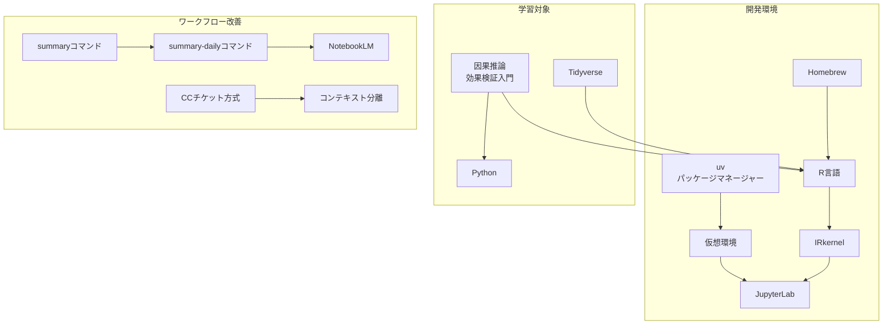
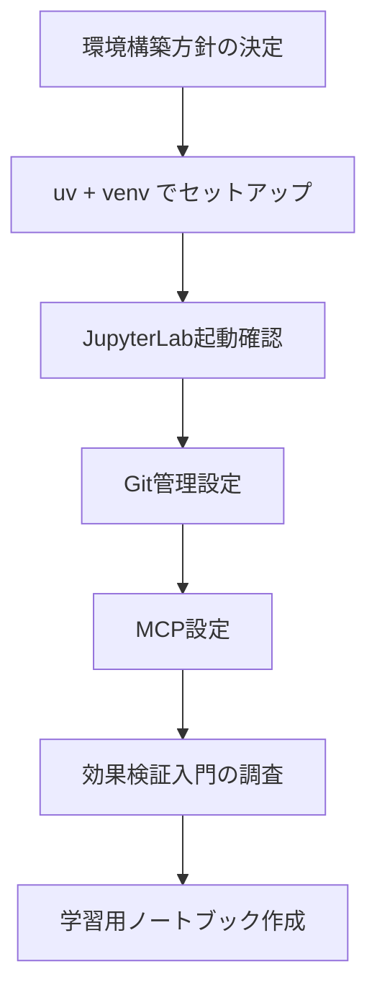
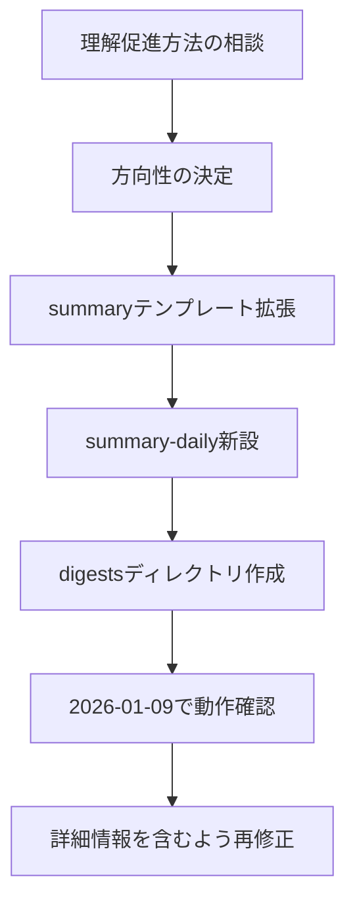
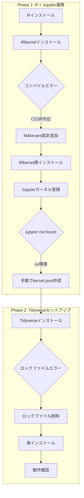
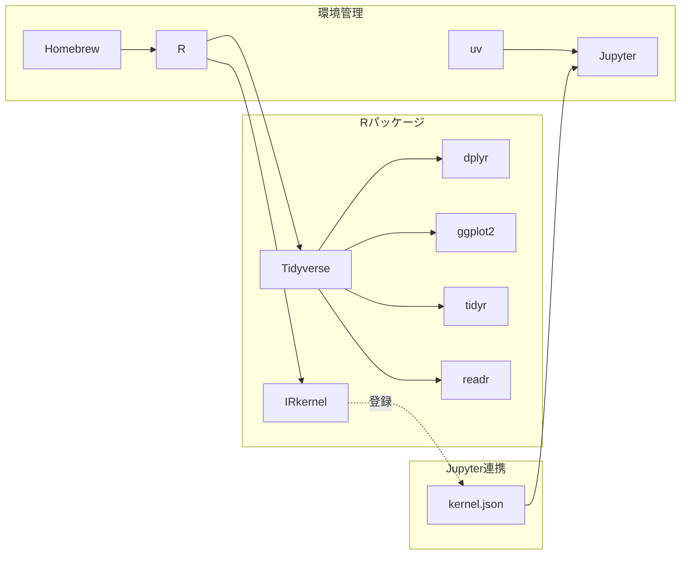
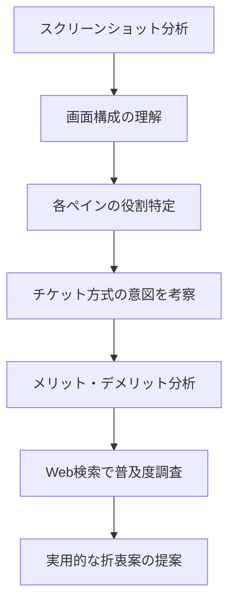
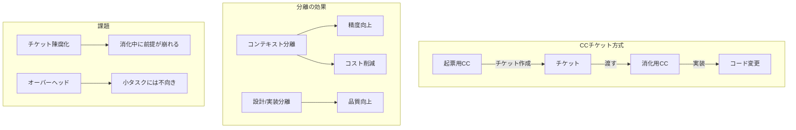

# Daily Learning Digest: 2026-01-12

---

## Overview

### Today's Sessions
1. [JupyterLab + Python 環境構築](#session-1-jupyterlab--python-環境構築) - uvを使ったPython環境のセットアップ
2. [Python + JupyterLab環境構築と因果推論学習準備](#session-2-python--jupyterlab環境構築と因果推論学習準備) - 効果検証入門の学習準備とノートブック作成
3. [/summary コマンド拡張と /summary-daily 新設](#session-3-summary-コマンド拡張と-summary-daily-新設) - 学習振り返り機能の強化
4. [R環境セットアップ（Jupyter + Tidyverse）](#session-4-r環境セットアップjupyter--tidyverse) - JupyterでR言語を使えるようにする
5. [Claude Codeチケット駆動ワークフローの分析](#session-5-claude-codeチケット駆動ワークフローの分析) - 熟練者のClaude Code活用法を学ぶ

### Concepts Covered（統合マップ）



- **uv → venv → JupyterLab**: Rust製の高速パッケージマネージャーでPython環境を管理
- **Homebrew → R → IRkernel → JupyterLab**: macOSでのR環境とJupyter連携
- **/summary → /summary-daily → NotebookLM**: セッション記録を日次で集約し振り返りに活用
- **CCチケット方式 → コンテキスト分離**: 設計と実装を分けてClaude Codeの精度を向上

### Decisions Made

| セッション | 選択 | 理由 |
|------------|------|------|
| Session 1 | uv（パッケージマネージャー） | 高速・シンプル・Rust製で将来性あり |
| Session 2 | D案（ハイブリッド学習） | 公式RコードとPython実装を参照しながら章ごとに進める |
| Session 3 | 概念マップ + Why/How | 理解促進のため両方採用。セッション単位で小さく生成 |
| Session 4 | 手動kernel.json作成 | uv環境ではIRkernel::installspec()が動かないため |
| Session 5 | 中規模タスクから試す | オーバーヘッドとのバランスを見て適用範囲を決定 |

---

## Session Details

### Session 1: JupyterLab + Python 環境構築

#### 目的・背景
- 因果推論・統計の学習を始めたい
- Web系自社企業でデータ基盤を整える準備として基礎を学びたい
- PythonとRを勉強したいが、まずはPythonから始める

#### やったこと

```
uv インストール → 仮想環境作成 → ライブラリ導入 → git初期化 → 動作確認
```

**ディレクトリ構成:**
```
~/jupyter/
├── .venv/                  ← 仮想環境（Python 3.14.2）
│   ├── bin/
│   │   ├── activate.fish   ← fish用
│   │   ├── python
│   │   └── jupyter
│   └── lib/
├── .git/
├── .gitignore
└── *.ipynb                 ← ノートブック
```

**Step 1: uv インストール**
```bash
brew install uv
```

**Step 2: 仮想環境作成**
```bash
cd ~/jupyter
uv venv
```

**Step 3: ライブラリインストール**
```bash
uv pip install jupyterlab pandas numpy matplotlib seaborn scipy statsmodels
```
→ 106パッケージがインストールされた

**Step 4: git初期化**
```bash
git init
# .gitignore作成（.venv/, __pycache__/, .ipynb_checkpoints/ 等を除外）
git add .gitignore && git commit -m "Initial commit: add .gitignore"
```

**Step 5: 起動確認**
```bash
uv run jupyter lab
```
→ ブラウザでJupyterLabが起動

#### 学び・注意点

| 概念 | 説明 |
|------|------|
| **uv** | pip互換の高速パッケージマネージャー（Rust製） |
| **venv** | プロジェクトごとにライブラリを分離する仮想環境 |
| **JupyterLab** | ブラウザで動くコード実行環境（Webアプリ） |
| **カーネル** | 実際にコードを実行するエンジン（Python, R等） |

**fishシェルでの注意点:**
標準の `source .venv/bin/activate` は動かない。

**解決策**: `uv run` を使う
```bash
uv run jupyter lab      # activate不要
uv run python script.py # 仮想環境内で実行
```

理由: uvが直接 `.venv/bin/python` を使ってコマンド実行するため、シェルに依存しない。

---

### Session 2: Python + JupyterLab環境構築と因果推論学習準備

#### 目的・背景
- 因果推論を学びたい（効果検証入門を読む予定）
- Web系企業でデータ基盤を整えるための基礎を身につけたい
- PythonとJupyterLabで分析環境を構築したい

#### やったこと



**Step 1: パッケージ管理の選定**
- pip+venv / uv / conda / poetry / rye を比較
- **uv** を選択（高速、シンプル、Rust製）

**Step 2-4: 環境構築・Git管理（Session 1と同様）**

**Step 5: MCP設定**
- `.claude/settings.json` に Jupyter MCP Server を設定
- トークンなし（ローカル開発用）

**Step 6: 効果検証入門の調査**
- 書籍の概要・レビューをWeb検索
- Python実装が有志により複数公開されていることを確認
- `効果検証入門.md` に要約を保存

**Step 7: 学習用ノートブック作成**
- D案（ハイブリッド）を採用
- 章ごとのノートブック骨格を作成（ch1〜ch5）

**成果物:**
```
~/jupyter/
├── .claude/
│   └── settings.json      # MCP設定
├── .gitignore
├── .venv/                  # Python 3.14.2
├── 効果検証入門.md          # 書籍概要
├── notebooks/
│   ├── ch1_RCTとセレクションバイアス.ipynb
│   ├── ch2_回帰分析.ipynb
│   ├── ch3_傾向スコア.ipynb
│   ├── ch4_DIDとCausalImpact.ipynb
│   └── ch5_RDD.ipynb
├── data/
└── Untitled.ipynb          # 動作確認用
```

#### 学び・注意点

| 項目 | 内容 |
|------|------|
| uv run | venv activateなしでコマンド実行。シェル（fish/bash/zsh）に依存しない |
| Python 3.14 | 新しすぎてJupyter AIが非対応（langchain/pydanticの問題） |
| MCP設定 | トークンなしなら `settings.json` でGit管理可能 |
| 効果検証入門 | Python実装が複数あり、参照しながら学べる |

**次回への注意点:**
- Jupyter AIを使いたい場合はPython 3.12で環境を作り直す
- 4章でCausalImpactを使う際は `uv pip install pycausalimpact` が必要
- 5章でRDDを使う際は `uv pip install rdd` が必要

**参考リンク:**
- [効果検証入門（技術評論社）](https://gihyo.jp/book/2020/978-4-297-11117-5)
- [公式Rコード（GitHub）](https://github.com/ghmagazine/cibook)
- [Python実装（nekoumei版）](https://github.com/nekoumei/cibook-python)
- [Python実装（shyaginuma版）](https://github.com/shyaginuma/cibook-study-python)

---

### Session 3: /summary コマンド拡張と /summary-daily 新設

#### 目的・背景
- LLMを使う際に「outputを得る」だけでなく「自分の理解を深める」ことに重点を置きたかった
- セッション記録を後からNotebookLMに読ませて振り返りたかった
- 既存の `/summary` だけでは概念間の関係や選択理由が記録されていなかった

#### やったこと



**Step 1: 理解促進の方向性を決定**
- 選択肢を提示して対話的に決定
- 概念マップ: セッション単位
- Why/How: /summary の学びセクション拡張
- NotebookLM連携: 日次まとめ生成

**Step 2: /summary コマンド拡張**
- コンテキスト収集に「概念とその関係」「選択したアプローチと他の選択肢」を追加
- テンプレートに「概念マップ」セクション（セクション3）を追加
- 「学び・注意点」に「なぜこのアプローチを選んだか」を追加

**Step 3: /summary-daily コマンド新設**
- 当日のセッションファイルを全て読み込み
- 概念・学びを集約してNotebookLM向けフォーマットで出力
- 保存先: `sessions/digests/YYYY-MM-DD.md`

**Step 4: 動作確認と修正**
- 2026-01-09 のセッション4件で日次まとめを生成
- 情報量が少なかったため、詳細情報もフルで含むようテンプレートを修正
- 約90行 → 約380行の詳細版に再生成

#### 概念マップ

```mermaid
graph LR
    subgraph 理解促進の要素
        ConceptMap[概念マップ]
        WhyHow[Why/How記録]
        Reflection[振り返り問い]
    end

    subgraph 出力形式
        Summary[/summary<br>セッション単位]
        SummaryDaily[/summary-daily<br>日次まとめ]
    end

    subgraph 活用先
        NotebookLM[NotebookLM]
        FutureReview[将来の振り返り]
    end

    ConceptMap --> Summary
    WhyHow --> Summary
    Summary --> SummaryDaily
    Reflection --> SummaryDaily
    SummaryDaily --> NotebookLM
    SummaryDaily --> FutureReview
```

#### 学び・注意点

**検討した選択肢:**
| 選択肢 | 概要 |
|--------|------|
| Why/How の掘り下げ | なぜこうなっているのか、他の方法はあったか |
| 概念の繋がり可視化 | 扱った概念間の関係をMermaid図で表現 |
| 説明形式で出力 | Feynman Technique的に「誰かに説明する形」でまとめる |
| 間違い・試行錯誤の記録 | 最初の仮説と結果のズレを記録 |

**選んだ理由:**
- 「概念マップ」と「Why/How」の両方を選択
- 概念マップはセッション単位で小さく生成（複雑になりすぎない）
- Why/How は /summary の学びセクション拡張で対応（追加負荷を最小化）

**学んだこと:**
1. **NotebookLMに読ませるなら詳細情報が必要**
   - 最初の日次まとめは要約しすぎて情報量が不足
   - 元のセッションファイルの内容をほぼそのまま含める形が有用

2. **テンプレートの構造**
   - Overview（統合マップ + 意思決定表）+ Session Details（各セッションの全内容）
   - ページ内リンクで目次から各セッションにジャンプ可能

3. **対話的な設計プロセス**
   - 選択肢を提示してユーザーと一緒に方向性を決める
   - 「一緒に考えて」という相談には、まず選択肢を整理して提示

---

### Session 4: R環境セットアップ（Jupyter + Tidyverse）

#### 目的・背景
- R言語をJupyter Notebookで使いたい
- 「効果検証入門」を進めるためにTidyverseが必要
- 既存のJupyterLab環境（uv管理）にRカーネルを追加したい

#### やったこと



**Step 1: Rのインストール**
```bash
brew install r
```
- R 4.5.2 がインストールされた
- 多数の依存関係（gcc, openblas等）も同時にインストール

**Step 2: IRkernelインストール（失敗）**
```r
install.packages('IRkernel', repos='https://cran.rstudio.com/')
```
- **エラー**: `error: invalid value 'gnu23' in '-std=gnu23'`
- 原因: R 4.5はC23標準を使用するが、Apple Clangは非対応

**Step 3: コンパイラ設定のオーバーライド**
`~/.R/Makevars` を作成:
```makefile
# Apple Clang doesn't support C23 yet, use C17 instead
CC = clang -std=gnu17
CC23 = clang -std=gnu17
```

**Step 4: IRkernel再インストール（成功）**
```r
install.packages('IRkernel', repos='https://cran.rstudio.com/')
```

**Step 5: Jupyterカーネル登録**
- `IRkernel::installspec()` は失敗（jupyterコマンドがPATHにない）
- uv環境のJupyterを使用していたため、手動で登録

`~/Library/Jupyter/kernels/ir/kernel.json`:
```json
{
  "argv": ["/opt/homebrew/bin/R", "--slave", "-e", "IRkernel::main()", "--args", "{connection_file}"],
  "display_name": "R",
  "language": "R"
}
```

**Step 6: 動作確認**
```bash
uv run jupyter kernelspec list
# ir カーネルが表示される
```

**Step 7: Tidyverseインストール（Rコンソールから）**
```r
install.packages("tidyverse")
```
- CRANミラー選択: `1: 0-Cloud` または `48: Japan (Yonezawa)` を選択
- 初回は多数の依存パッケージをコンパイルするため5〜10分かかる

**Step 8: ロックファイルエラーの対処**
並列インストール時にロックファイルが残り、一部パッケージが失敗：
```r
# ロックファイル削除後に再インストール
unlink("/opt/homebrew/lib/R/4.5/site-library/00LOCK-ragg", recursive = TRUE)
install.packages(c("ragg", "tidyverse"))
```

**Step 9: Tidyverse動作確認**
```r
library(tidyverse)
```
- パッケージ一覧と「Conflicts」メッセージが表示されれば成功
- 赤い「Conflicts」はエラーではなく、関数の上書き通知

#### 概念マップ



#### Tidyverseの構成

| パッケージ | 用途 |
|------------|------|
| dplyr | データ操作（filter, select, mutate, group_by） |
| ggplot2 | データ可視化・グラフ作成 |
| tidyr | データ整形（縦横変換） |
| readr | CSV等のファイル読み込み |
| stringr | 文字列操作 |
| purrr | 関数型プログラミング |

#### R初心者向け知識

**PythonとRの違い:**

| 項目 | Python | R |
|------|--------|---|
| インデックス | 0から始まる | **1から始まる** |
| 代入 | `=` | `<-` が伝統的 |
| パッケージ読み込み | `import pandas` | `library(tidyverse)` |
| 欠損値 | `None` / `NaN` | `NA` |
| パイプ | メソッドチェーン | `%>%` または `|>` |

**Tidyverseの命名由来:**
- **Tidy**（整然）+ **verse**（世界/宇宙）
- "Tidy data"（整然データ）という概念が由来
- 1行1観測、1列1変数という哲学

**パイプの例:**
```r
# 処理をつなげて書ける
df %>%
  filter(age > 20) %>%
  select(name, score) %>%
  summarize(avg = mean(score))
```

#### 学び・注意点

| 問題 | 原因 | 解決策 |
|------|------|--------|
| IRkernelコンパイル失敗 | Apple ClangがC23非対応 | `~/.R/Makevars`でC17に変更 |
| `IRkernel::installspec()`失敗 | uvのjupyterがPATHにない | 手動でkernel.json作成 |
| Tidyverseインストール途中失敗 | ロックファイルの競合 | `unlink()`でロック削除後に再実行 |
| Conflicts警告（赤い表示） | dplyrがstatsの関数を上書き | 正常動作。エラーではない |

**作成されたファイル:**

| ファイル | 用途 |
|----------|------|
| `~/.R/Makevars` | RパッケージのコンパイラC標準設定 |
| `~/Library/Jupyter/kernels/ir/kernel.json` | JupyterのRカーネル設定 |
| `~/jupyter/r_basics_tutorial.ipynb` | R基本操作チュートリアルノートブック |

---

### Session 5: Claude Codeチケット駆動ワークフローの分析

#### 目的・背景
- Slackで共有されたClaude Code開発環境のスクリーンショットを見て、その構成の意図を理解したかった
- 「CCチケット起票用」「CCチケット消化用」という分離が何を意味するのか深く分析したかった

#### やったこと



**Step 1: 画面構成の分析**
tmuxで分割された画面構成を特定:
- **nvim**: メインエディタ（2ペイン）
- **CCチケット起票用1**: バグ修正系タスクの設計
- **CCチケット起票用2**: Feature系タスクの設計
- **CCチケット消化用**: 実際の実装作業
- **ローカルサーバー**: 開発サーバー
- **手動コマンド用**: git操作など
- **docker compose**: コンテナログ

**Step 2: 「起票」と「消化」分離の意図を考察**
- コンテキスト分離による精度向上
- 「設計」と「実装」の明確な分離
- 各セッションを軽量に保つことでコスト効率化

**Step 3: メリット・デメリットの詳細分析**
- メリット: コンテキスト効率、精度向上、並列作業、追跡可能性
- デメリット: チケット陳腐化、オーバーヘッド、情報分断、硬直化リスク

**Step 4: 普及度のWeb調査**
- タスクファイル方式（ROADMAP.md + /tasks/）は中〜高の普及度
- tmux複数セッション方式は先進的でまだニッチ

#### 概念マップ



- **起票用CC → チケット → 消化用CC**: 情報の流れ。文脈の一部が失われるリスクあり
- **コンテキスト分離 → 精度向上/コスト削減**: Claude Codeの特性を活かした設計
- **チケット陳腐化**: 並列作業時の最大の課題

#### 学び・注意点

**なぜこのアプローチが有効か:**
- Claude Codeは長いセッション → コンテキスト増大 → 遅い/高い/精度低下
- 役割別に分離することで各セッションを軽量に保てる
- 公式も「研究と計画を先に」を推奨している

**検討した選択肢と比較:**

| アプローチ | 向いている場面 | 課題 |
|-----------|---------------|------|
| 1セッションで全部 | 小タスク、探索的作業 | コンテキスト肥大化 |
| CLAUDE.md + TODO | 中規模タスク | ファイル管理のみ |
| CCチケット方式 | 大規模・複数ステップ | オーバーヘッド |
| サブエージェント | 大規模プロジェクト | 設定が複雑 |

**参考リソース:**
- [Minimalist Claude Code Task Management Workflow | Medium](https://medium.com/nick-tune-tech-strategy-blog/minimalist-claude-code-task-management-workflow-7b7bdcbc4cc1)
- [Claude Code: Best practices for agentic coding | Anthropic](https://www.anthropic.com/engineering/claude-code-best-practices)
- [Claude Code Orchestrator | mizchi](https://zenn.dev/mizchi/articles/claude-code-orchestrator)
- [Claude Codeで理想のタスク管理環境を30分で構築 | エムスリー](https://www.m3tech.blog/entry/2025/08/18/100000)

#### 自分のワークフローへの適用メモ

**採用方針:**
- **まずは中規模タスクから試す**: 小さいタスクには適用せず、中規模以上で効果を検証
- **起票用/消化用の2分割から始める**: 3つ以上に分けず、シンプルな構成から

**具体的なステップ:**
1. 複数ファイル・複数ステップが必要なタスクを特定
2. まず「起票用」セッションで分解・設計（5-10分）
3. チケット形式で構造化（タイプ、影響範囲、手順）
4. 「消化用」セッションにチケット内容を渡して実装
5. 効果を検証し、必要に応じて調整

**注意点:**
- チケット陳腐化に注意: 消化前に内容を再確認する習慣
- 小さいタスクには適用しない: オーバーヘッドの方が大きくなる
- 依存関係を意識: 複数チケットが同じ領域に触る場合は注意

---

## Reflection Prompts

- Python環境でuvを使うメリットは何か？fishシェルユーザーにとって特に便利な点は？
- R言語でのTidyverseの「Tidy data」哲学とは何か？Pythonのpandasと比較してどう違う？
- Claude Codeで「設計」と「実装」を分離することの意義は？どんなタスクに適用すべきか？
- /summaryと/summary-dailyの関係性は？日々の振り返りにどう活用できるか？
- IRkernelのインストールで発生したC23エラーの根本原因は？将来どう解決されそうか？
