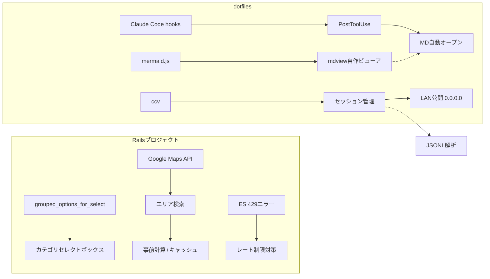

# Daily Learning Digest: 2026-01-13

> JSONLから自動抽出・分析

---

## Overview

### Today's Projects
1. [Railsプロジェクト](#project-1-railsプロジェクト) - カテゴリセレクトボックス改善、エリア検索設計、ES障害分析
2. [dotfiles](#project-2-dotfiles) - MD自動プレビュー、Claude Code観測ツール、ccvのLAN公開

### Concepts Covered（統合マップ）



- **A → B**: Railsのgrouped_options_for_selectを使ってカテゴリをoptgroupでグループ化
- **C → D → E**: エリア検索はAPIコスト考慮で事前計算方式を採用
- **H → I**: mermaidレンダリングにはJSが必要なため自作ビューア
- **J → K → L**: Claude Code hooksでツール実行後に自動処理

### Key Decisions

| プロジェクト | 選択 | 理由 |
|--------------|------|------|
| Railsプロジェクト | grouped_options_for_select | 条件分岐が明確、既存selectとの置き換え容易 |
| Railsプロジェクト | 事前計算+キャッシュ方式 | APIコスト抑制、検索速度向上 |
| dotfiles | mdview自作 | glow/gripではmermaid描画不可、JS実行環境が必要 |
| dotfiles | ccv一本化 | 複数ツールより高機能な1つに絞る方が管理が楽 |
| dotfiles | LAN公開でパスワード設定 | 0.0.0.0バインドにはパスワード保護必須 |

---

## Project Details

### Project 1: Railsプロジェクト

#### 目的・背景
- 特定プランの企業向け編集画面でカテゴリを大分類（A/Bカテゴリ）でグループ化
- 店舗マスタ起点で一定距離内のユーザーを検索する機能の設計
- ES 429エラー発生時のビジネス影響分析

#### やったこと


**カテゴリセレクトボックス**
- Task（Explore）を3つ同時起動して並列調査
- 発見したパターン: `grouped_collection_select`, `grouped_options_for_select`, `GroupedPulldown`
- プラン判定メソッドで条件分岐を実装

**エリア検索**
- 問題発見: 店舗マスタには緯度経度あり、ユーザーにはなし（市区町村単位のみ）
- 提案: キャッシュテーブルで店舗×市区町村の距離を事前計算

**ES 429エラー分析**
- 影響: バッチ処理遅延 → 通知遅延 → 機会損失
- 対策: バルク処理、スロットリング、インデックス最適化

#### 学び・注意点

| 項目 | 内容 |
|------|------|
| 調査戦略 | 独立した調査は並列でサブエージェント起動 |
| 既存パターン活用 | 新規実装より既存実装の流用を優先 |
| プラン分岐の複雑さ | サイトにはA/B/C/Dカテゴリの各フリープランが存在 |
| 定数の活用 | `CATEGORY_IDS`等のビジネスロジック定数を確認してから実装 |
| APIコスト | Google Maps APIは従量課金、事前計算+キャッシュが有効 |

---

### Project 2: dotfiles

#### 目的・背景
- Claude Codeで出力したMDファイルを即座にmermaid付きで確認したい
- Claude Codeの動作を観測・記録するツールを整備
- ccvをLAN内の他端末からアクセス可能にしたい
- 理解促進のためのsummaryコマンドを拡張

#### やったこと


**MDプレビューツール**
- glow: ターミナル内で軽快だがmermaid不可
- grip: GitHub風表示だがmermaid不可（JS実行環境なし）
- 解決: Python http.server + mermaid.js CDNで自作ビューア

**Claude Code hooks**
```json
"hooks": {
  "PostToolUse": [{
    "matcher": "Write",
    "hooks": [{"type": "command", "command": "...md-auto-open.sh"}]
  }]
}
```

**fishバックグラウンド処理**
```fish
# NG: sleepがブロック
sleep 5; open -a Safari "$URL"

# OK: 別プロセス化
fish -c "sleep 5; open -a Safari $URL" &
```

**ccv LAN公開**
- `--hostname 0.0.0.0` でバインド（localhost制限解除）
- `--password kami` でパスワード保護
- macOS mDNSで `http://dev.local:3400` アクセス可能

#### 学び・注意点

| 項目 | 内容 |
|------|------|
| mermaidレンダリング | JS必須、CLIツールでは原理的に無理 |
| Electronの罠 | 「軽量」と謳っていてもChromium内包で重い |
| fishバックグラウンド | `fish -c "..." &`で別プロセス化が必要 |
| LAN公開セキュリティ | 0.0.0.0バインドにはパスワード保護必須 |
| シンプルさ優先 | 複数ツールより高機能な1つに絞る |
| hooks反映 | 設定変更後はcc再起動が必要 |
| JSONL構造 | thinking、サブエージェント情報、トークン数も記録されている |
| NotebookLM向け | 要約だけでは不十分、詳細情報が必要 |

---

## Reflection Prompts

- **エリア検索で「事前計算+キャッシュ」を選んだが、データ鮮度とコストのトレードオフはどう評価すべきか？バッチ間隔は何を基準に決める？**

- **mdviewを自作したが、VS Code拡張やブラウザ拡張という選択肢もあった。ツール自作 vs 既存活用の判断基準は何か？**

- **cclogviewerを導入後すぐ削除した。「試してから捨てる」アプローチは効率的か、それとも事前調査で避けられたか？**

- **Claude Code hooksの`PostToolUse`で処理を追加したが、フックが増えると処理が遅くなる懸念がある。どこまでフックを増やすべきか？**

- **fishの`fish -c "..." &`パターンは他の場面でも使えそう。非同期処理が必要な場面をリストアップするとどうなるか？**
