> JSONLから自動抽出・分析（詳細版 - 情報省略なし）

---

## Overview

### Today's Sessions

**rejob-v2 プロジェクト（8セッション）**
1. [N+1問題の修正（ClientDecorator）](#session-1-n1問題の修正clientdecorator) - Rails Decoratorの最適化
2. [Claude Code設定の全体像調査](#session-2-claude-code設定の全体像調査) - commands/skills/agentsの体系化
3. [タスク管理コマンド（/task）の設計](#session-3-タスク管理コマンドtaskの設計) - Backlog→PR作成の自動化ワークフロー
4. [task:summary リネーム検討](#session-4-tasksummary-リネーム検討) - spec_summaryへの名称変更
5. [task:create_pr_description の実行](#session-5-taskcreate_pr_description-の実行) - PR概要自動生成
6. [task:summary のリネーム実装](#session-6-tasksummary-のリネーム実装) - 影響範囲の詳細調査
7. [pr-review-toolkit の使い方確認](#session-7-pr-review-toolkit-の使い方確認) - 6つの専門エージェント
8. [/digest コマンドのリファクタリング検討](#session-8-digest-コマンドのリファクタリング検討) - 出力ボリューム10倍化

**dotfiles プロジェクト（4セッション）**
9. [Learning Output Style 調査と pr-review-toolkit 導入](#session-9-learning-output-style-調査と-pr-review-toolkit-導入) - 3つのOutput Styles
10. [Claude設定構成図ファイルの検索](#session-10-claude設定構成図ファイルの検索) - ファイル探索
11. [MCPコンテキスト使用量の最適化](#session-11-mcpコンテキスト使用量の最適化) - 12%は良好、newrelic削除
12. [New RelicルールのPreToolUseフック移行](#session-12-new-relicルールのpretooluse-フック移行) - CLAUDE.mdからフックへ

**cursor プロジェクト（1セッション）**
13. [Cursorチャット履歴の調査と抽出ツール作成](#session-13-cursorチャット履歴の調査と抽出ツール作成) - SQLite3解析とPython抽出スクリプト

---

### Concepts Covered（統合マップ）

```mermaid
graph TB
    subgraph "rejob-v2: 開発ワークフロー"
        A[Backlogチケット] --> B["/task init"]
        B --> C["/task spec"]
        C --> D["実装"]
        D --> E["/task review"]
        E --> F["/task pr"]
        C --> SS["/task spec_summary"]
    end

    subgraph "rejob-v2: コード品質"
        G[N+1問題] --> H[可読性優先で修正]
        I[pr-review-toolkit] --> J[6エージェント並列レビュー]
    end

    subgraph "dotfiles: 設定最適化"
        K[Output Styles] --> L[Default/Explanatory/Learning]
        M[MCPコンテキスト] --> N[12%は良好]
        N --> O[newrelic削除]
        P[PreToolUseフック] --> Q[条件付きルール適用]
    end

    subgraph "cursor: 履歴抽出"
        R[state.vscdb] --> S[ItemTable]
        S --> T[chatdata JSON]
        T --> U[Markdown出力]
    end

    subgraph "学習記録"
        V["/digest"] --> W[詳細化 /digest_long]
        X["/summary"] --> Y[セッション記録]
    end
```

- **Backlog → /task init → /task spec → 実装 → /task review → /task pr**: rejob-v2での開発ワークフロー自動化
- **N+1問題 → 可読性優先**: 固定数ループではクエリ差より可読性を優先する判断
- **MCPコンテキスト12% → newrelic削除**: 不要なMCPを削除してコンテキスト節約
- **state.vscdb → ItemTable → chatdata JSON → Markdown**: Cursor履歴の抽出フロー

---

### Key Decisions Summary

| セッション | 選択 | 理由 |
|------------|------|------|
| Session 1 | シンプル版N+1修正（3クエリ） | カテゴリ2つ固定なので可読性優先 |
| Session 2 | /commit コマンド新設 | commit-helperエージェントをコマンド化 |
| Session 3 | /task ワークフロー設計 | Backlog→PR作成を自動化 |
| Session 5 | spec.md を主要ソース | backlog.md より詳細な情報源 |
| Session 9 | Learning Output Style 見送り | 開発速度低下のトレードオフ |
| Session 9 | pr-review-toolkit 導入 | 6エージェントで多角的レビュー |
| Session 11 | newrelic MCP 削除 | 未使用のためコンテキスト節約 |
| Session 11 | Context7 残す | 最新ライブラリ情報取得に有用 |
| Session 12 | PreToolUseフックに移行 | CLAUDE.md常時読み込みから条件付き適用へ |
| Session 13 | Python抽出スクリプト作成 | SQLite3解析でMarkdown出力 |

---

## Session Details

---

### Session 1: N+1問題の修正（ClientDecorator）

#### 目的・背景
- `app/decorators/client_decorator.rb` の93-98行目にN+1クエリの問題があると指摘を受け、修正を依頼された
- 宿泊プラン用の職種グルーピング機能 (`grouped_business_types_for_hotel_plan`) がループ内でDBクエリを発行していた

#### やったこと

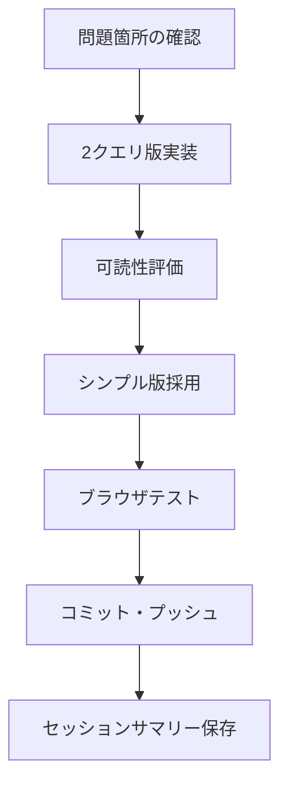

**Step 1: 問題箇所の確認**
- 元のコード:
```ruby
def grouped_business_types_for_hotel_plan
  [BusinessTypeCategory::RESTAURANT_ID, BusinessTypeCategory::HOTEL_ID].each_with_object({}) do |category_id, hash|
    category = BusinessTypeCategory.find(category_id)  # N+1発生箇所
    hash[category.name] = BusinessType.where(business_type_category_id: category_id).ordered.pluck(:name, :id)  # N+1発生箇所
  end
end
```
- 問題: ループ内で`find`と`where.pluck`が毎回呼ばれ、4回のクエリが発生

**Step 2: 2クエリ版での修正（複雑版）**
- カテゴリとビジネスタイプを一括取得
- `group_by`で効率化を試みた

**Step 3: 可読性改善（シンプル版に書き換え）**
- 判断: カテゴリが2つ固定なので、複雑な最適化より可読性を優先
- 3クエリ版（シンプル）を採用

#### 設定・コード例

修正後のコード:
```ruby
def grouped_business_types_for_hotel_plan
  category_ids = [BusinessTypeCategory::RESTAURANT_ID, BusinessTypeCategory::HOTEL_ID]
  categories = BusinessTypeCategory.where(id: category_ids).index_by(&:id)
  business_types_by_category = BusinessType.where(business_type_category_id: category_ids)
                                           .ordered
                                           .pluck(:business_type_category_id, :name, :id)
                                           .group_by(&:first)

  category_ids.each_with_object({}) do |category_id, hash|
    category = categories[category_id]
    next unless category

    types = business_types_by_category[category_id] || []
    hash[category.name] = types.map { |bt| [bt[1], bt[2]] }
  end
end
```

#### 学び・注意点

| 項目 | 内容 |
|------|------|
| 判断基準 | 固定数ループではクエリ差より可読性を優先 |
| テスト方法 | 「保存まで」を明確に指示すべき |
| 確認手法 | スクショで実際の動作を目視確認が重要 |

---

### Session 2: Claude Code設定の全体像調査

#### 目的・背景
- Claude Codeのskill/hooks/commands/agentsなどの設定がどうなっているか把握したい
- 自分がプラスアルファで追加した設定の全体像を可視化したい

#### やったこと

```mermaid
flowchart TB
    A[ディレクトリ探索] --> B[設定ファイル一覧確認]
    B --> C[/commit コマンド作成]
    C --> D[CLAUDE.md 更新]
    D --> E[コミット]
```

#### 概念マップ

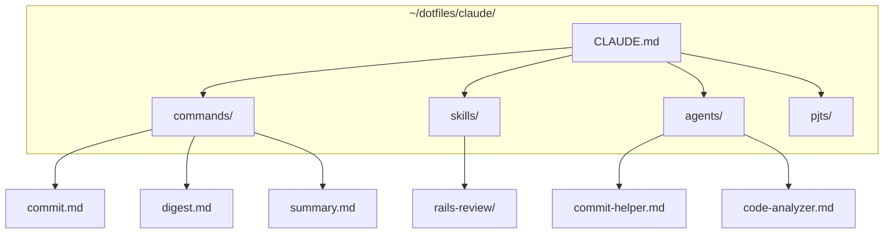

#### 学び・注意点

| 項目 | 内容 |
|------|------|
| 設定管理 | `~/dotfiles/claude/` で一元管理、`~/.claude` はシンボリックリンク |
| context: fork | サブエージェントを別プロセスで実行 |
| agent 指定 | 既存エージェントファイルを参照して動作 |

---

### Session 3: タスク管理コマンド（/task）の設計

#### 目的・背景
- Backlogチケットの情報取得からPR作成までを統合管理するワークフローを構築
- ブランチに紐づくタスク管理を自動化

#### やったこと

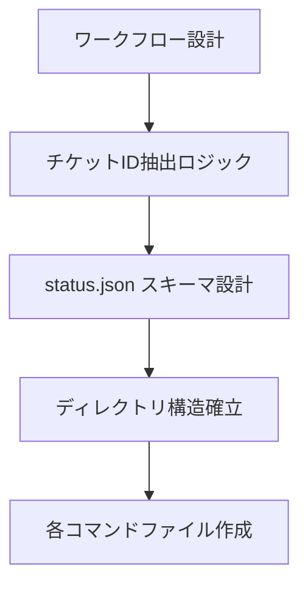

**ワークフロー設計**
- `/task` - 現在の状態表示 + 次アクション提案
- `/task init` - Backlog取得 + ディレクトリ作成 + status.json初期化
- `/task spec` - developブランチで現状コード調査 + 技術仕様書作成
- `/task review` - 仕様書と実装差分を比較し、PRレビュー実行
- `/task pr` - PR概要自動生成 + Push + PR作成/更新
- `/task summary` - 技術仕様書から図解付きサマリー作成

**status.json スキーマ設計**
```json
{
  "ticketId": "REJOB-DEV-DOING-XXXXX",
  "ticketKey": "REJOB_DEV_DOING-XXXXX",
  "branch": "feature/REJOB_DEV_DOING-XXXXX",
  "createdAt": "2025-01-14T10:00:00+09:00",
  "updatedAt": "2025-01-14T12:00:00+09:00",
  "steps": {
    "init": { "done": true, "at": "2025-01-14T10:00:00+09:00" },
    "spec": { "done": false },
    "review": { "done": false },
    "pr": { "done": false },
    "summary": { "done": false }
  },
  "prUrl": null,
  "prNumber": null
}
```

#### 概念マップ

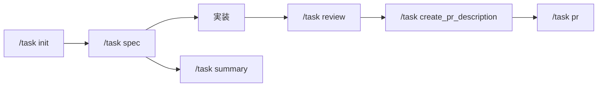

---

### Session 7: pr-review-toolkit の使い方確認

#### 目的・背景
- pr-review-toolkitの実行コマンドを確認したい

#### やったこと

```
スキル（直接実行）:
/pr-review-toolkit:review-pr - 包括的なPRレビュー

専門エージェント（Task tool経由）:
- code-reviewer - プロジェクトガイドライン準拠チェック
- silent-failure-hunter - サイレント障害検出
- code-simplifier - コード簡素化提案
- comment-analyzer - コメント正確性チェック
- pr-test-analyzer - テストカバレッジ分析
- type-design-analyzer - 型設計分析
```

#### 概念マップ

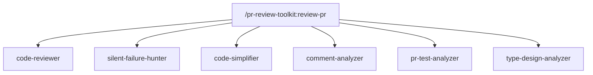

---

### Session 9: Learning Output Style 調査と pr-review-toolkit 導入

#### 目的・背景
- Claude Codeの「learning-output-style」機能の概要を理解し、図解付きドキュメントを作成したい

#### やったこと

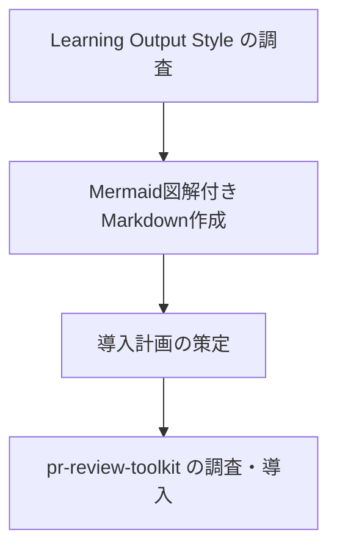

#### 設定・コード例

**Learning Output Style の3つのスタイル比較**:

| スタイル | コード自動生成 | 教育的説明 | ユーザー実装 | トークン消費 |
|----------|----------------|------------|--------------|--------------|
| Default  | 100%           | なし       | なし         | 少           |
| Explanatory | 100%        | あり       | なし         | 中           |
| Learning | 50-70%         | あり       | あり         | 多           |

**設定方法**:
```bash
/output-style learning   # セッション限定で切り替え
/output-style default    # 通常モードに戻す
```

#### 概念マップ

```mermaid
graph TB
    subgraph "Output Styles"
        D[Default<br/>効率重視] -->|100% 自動生成| OUT1[高速開発]
        E[Explanatory<br/>説明付き] -->|100% 自動 + Insight| OUT2[理解促進]
        L[Learning<br/>学習指向] -->|50-70% + TODO| OUT3[スキル習得]
    end

    subgraph "pr-review-toolkit"
        PR[/review-pr] --> A1[code-reviewer]
        PR --> A2[test-analyzer]
        PR --> A3[silent-failure-hunter]
        PR --> A4[comment-analyzer]
        PR --> A5[type-design-analyzer]
        PR --> A6[code-simplifier]
    end
```

---

### Session 11: MCPコンテキスト使用量の最適化

#### 目的・背景
- Claude CodeのMCPがコンテキストの12%を消費していることを懸念
- 使っていないMCPを特定し、削減すべきか検討したい

#### やったこと

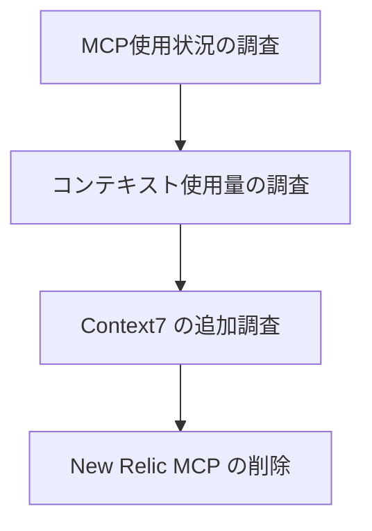

**MCP使用状況の調査**

| MCP | 用途 | 使用状況 | ツール数 |
|-----|------|----------|----------|
| github | PR/Issue操作 | 頻繁 | 20+ |
| postgres | DB操作 | 頻繁 | 1 |
| backlog | プロジェクト管理 | 頻繁 | 40+ |
| mermaid | 図表生成 | 時々 | 1 |
| chrome-devtools | ブラウザ自動化 | 時々 | 30+ |
| playwright | ブラウザ自動化 | 時々 | 20+ |
| **newrelic** | パフォーマンス監視 | **未使用** | 不明 |
| **context7** | ドキュメント検索 | **未使用** | 2 |

**コンテキスト使用量の調査**

| 状況 | コンテキスト% | 評価 |
|------|---------------|------|
| ユーザーの現状 | 12% | 良好 |
| 警告ライン | ~12.5%（25Kトークン） | - |
| 典型的5サーバー構成 | 27%（55Kトークン） | 普通 |
| 問題ケース | 33-50% | 要最適化 |

#### 概念マップ

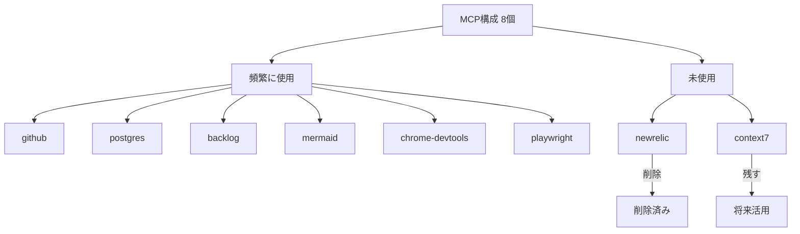

#### 学び・注意点

| 項目 | 内容 |
|------|------|
| MCPコンテキスト12%は良好 | 25%以上で警告、33%以上で問題 |
| Context7 の価値 | 知識カットオフ問題を解決、最新ライブラリ使用時に有用 |
| Context7 の使い方 | プロンプトに「use context7」を追加するだけ |
| Chrome DevTools vs Playwright | 用途が異なる（デバッグ vs 自動テスト）ため両方残す |

---

### Session 12: New RelicルールのPreToolUseフック移行

#### 目的・背景
- CLAUDE.mdに書かれているNew Relicルールを、MCPツール呼び出し時にだけ適用されるように変更したい

#### やったこと

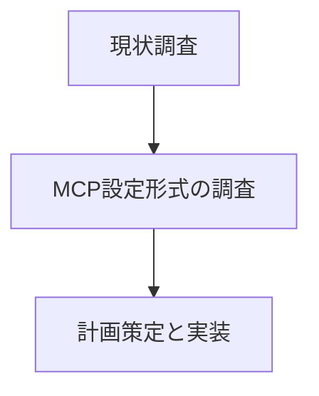

#### 設定・コード例

**追加した settings.json フック**:
```json
{
  "hooks": {
    "PreToolUse": [
      {
        "matcher": "mcp__newrelic__*",
        "hooks": [
          {
            "type": "command",
            "command": "echo '[NRQL利用ルール] クエリは1〜5本に抑える / 期間・対象を必ず明示 / 試行錯誤的な連続クエリは禁止'",
            "timeout": 5
          }
        ]
      }
    ]
  }
}
```

#### 概念マップ

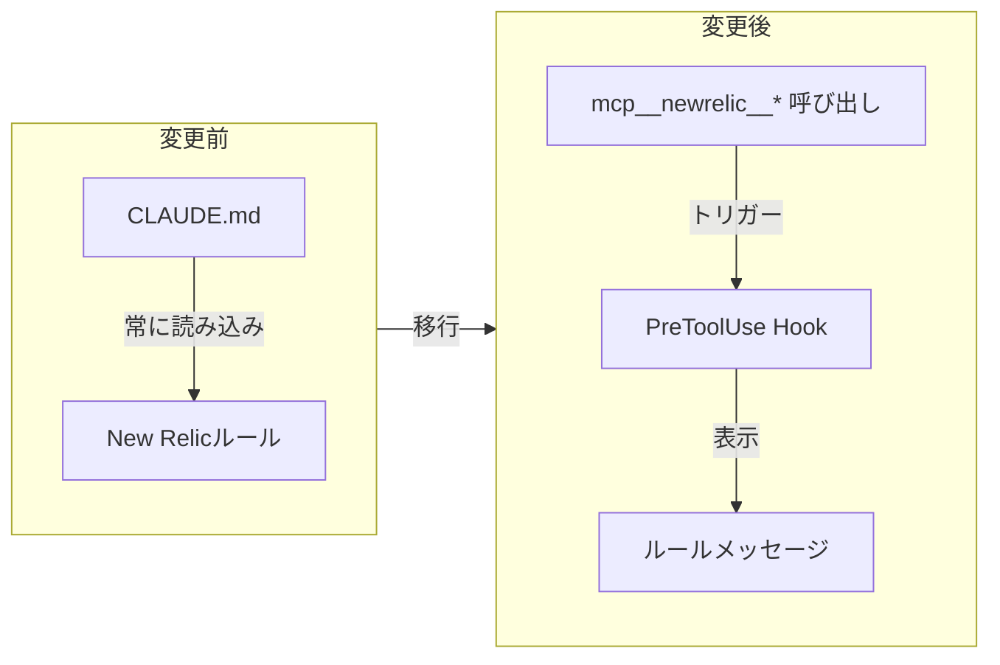

---

### Session 13: Cursorチャット履歴の調査と抽出ツール作成

#### 目的・背景
- Cursorエディタ（AI搭載コードエディタ）の会話履歴がどこに保存されているかを調査
- その履歴をMarkdown形式で綺麗に抽出したい

#### やったこと

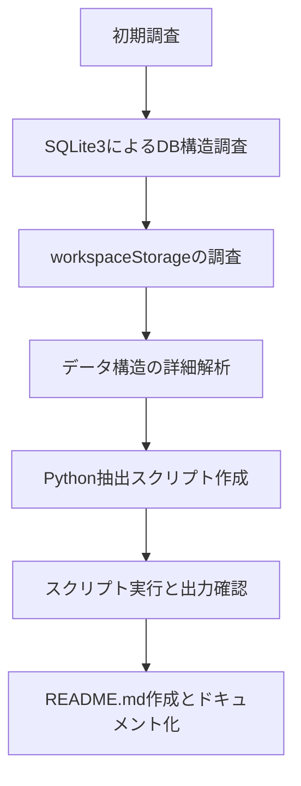

#### 設定・コード例

**SQLite3でチャットデータを取得するクエリ:**
```sql
SELECT value FROM ItemTable
WHERE key = 'workbench.panel.aichat.view.aichat.chatdata'
```

**Pythonでのデータ抽出パターン:**
```python
import sqlite3, json
conn = sqlite3.connect("state.vscdb")
cursor = conn.cursor()
cursor.execute("SELECT value FROM ItemTable WHERE key = 'workbench.panel.aichat.view.aichat.chatdata'")
chat_data = json.loads(cursor.fetchone()[0])
tabs = chat_data.get('tabs', [])
```

#### 概念マップ

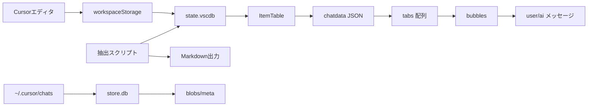

#### 学び・注意点

| 項目 | 内容 |
|------|------|
| データ保存場所 | `~/Library/Application Support/Cursor/User/workspaceStorage/*/state.vscdb` がメイン |
| データ形式 | SQLite3のItemTableにJSON形式で保存 |
| 主要キー | `workbench.panel.aichat.view.aichat.chatdata` |
| チャット構造 | tabs[].bubbles[].type (user/ai) で会話を区別 |
| タイムスタンプ | Unix milliseconds形式 |
| セキュリティ | `~/.cursor/mcp.json` に認証情報あり（共有注意） |

---

## Daily Summary

### 今日の成果物一覧

| プロジェクト | ファイル | 用途 |
|--------------|----------|------|
| rejob-v2 | `app/decorators/client_decorator.rb` | N+1問題修正 |
| rejob-v2 | `.claude/commands/task/*.md` | タスク管理コマンド群（8ファイル） |
| dotfiles | `~/dotfiles/claude/commands/commit.md` | /commit コマンド |
| dotfiles | `~/dotfiles/claude/claude.json` | newrelic MCP削除 |
| dotfiles | `~/dotfiles/claude/settings.json` | PreToolUseフック追加 |
| dotfiles | `~/dotfiles/claude/temp/learning-output-style-overview.md` | Output Styles 概要 |
| cursor | `~/.cursor/exports/extract_cursor_history.py` | 履歴抽出スクリプト |
| cursor | `~/.cursor/exports/README.md` | 仕組み解説 |
| claude | `~/.claude/commands/digest_long.md` | 詳細版digestコマンド |

### 今日学んだコマンド/設定

```bash
# SQLite3でCursorチャット履歴を取得
sqlite3 "state.vscdb" "SELECT value FROM ItemTable WHERE key = 'workbench.panel.aichat.view.aichat.chatdata'"

# Gitブランチ名からチケットID抽出
TICKET_ID=$(git branch --show-current | sed 's/feature\///' | sed 's/_/-/g')

# MCP設定のバックアップ
cp ~/dotfiles/claude/claude.json ~/dotfiles/claude/claude.json.backup.$(date +%Y%m%d)
```

```json
// PreToolUseフックで条件付きルール適用
{
  "hooks": {
    "PreToolUse": [
      {
        "matcher": "mcp__newrelic__*",
        "hooks": [{ "type": "command", "command": "echo 'ルール'" }]
      }
    ]
  }
}
```

### 明日への引き継ぎ事項

1. **task:summary → task:spec_summary リネーム未完了**
   - 影響箇所は特定済み（6ファイル）
   - 実際の変更は未実施

2. **Context7 MCPの活用**
   - 未使用だが残している
   - 最新ライブラリ情報取得時に「use context7」で活用可能

3. **pr-review-toolkit の実践**
   - インストール済み
   - 実際のPRレビューでの使用は未検証

4. **/digest_long コマンド作成済み**
   - 本日のダイジェストで初回実行
   - 出力ボリュームを検証し、必要に応じて調整

---

## Reflection Prompts

- **N+1問題の修正で「可読性優先」を選んだが、クエリ数差（4回→3回）が大きい場合はどう判断すべきか？閾値はあるか？**

- **タスク管理ワークフロー（/task）を設計したが、実際に使い続けると何が課題になりそうか？オーバーヘッドは許容範囲か？**

- **MCPコンテキスト12%は良好とのことだが、将来MCPを追加する際の判断基準は何か？25%を超えないようにすべきか？**

- **Cursor履歴抽出で発見した「state.vscdb + ItemTable」構造は、他のVSCode系エディタでも同様か？**

- **PreToolUseフックでルールを条件付き適用にしたが、他にCLAUDE.mdから切り出すべきルールはあるか？**
