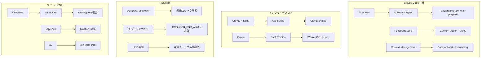
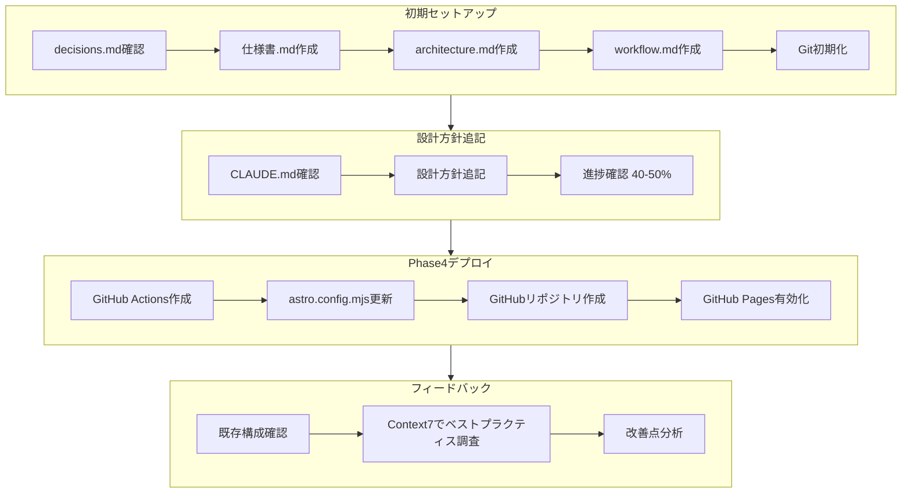
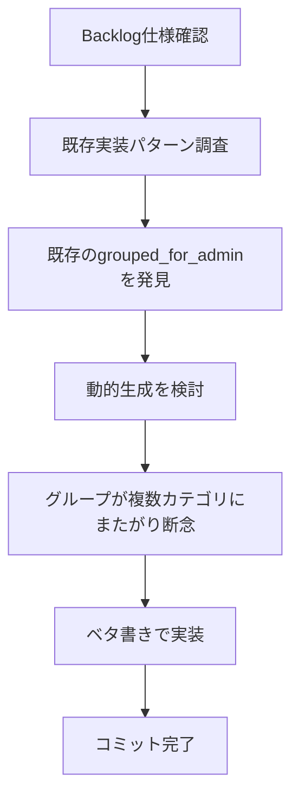
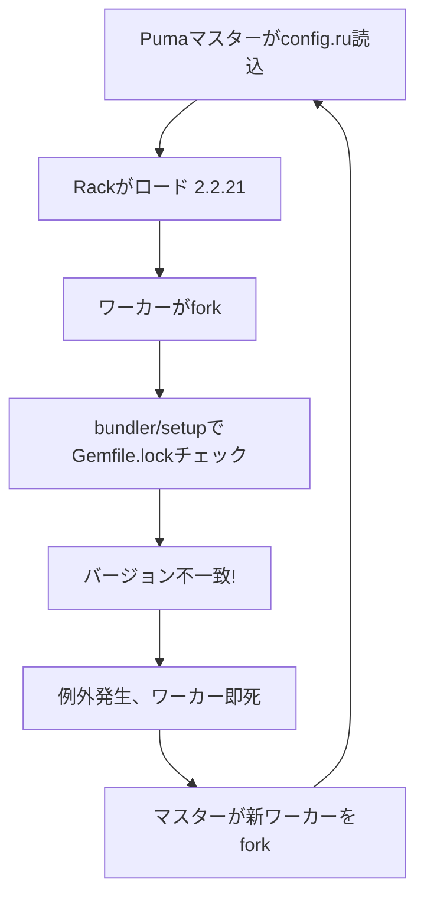
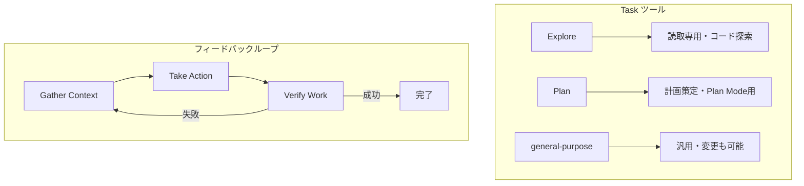

# Daily Learning Digest (Long): 2026-01-15

> JSONLから自動抽出・分析（詳細版 - 情報省略なし）

---

## Overview

### Today's Sessions

| # | プロジェクト | セッション | 概要 |
|---|-------------|-----------|------|
| 1 | jupyter | Jupyter Lab起動 | uv経由でのJupyter Lab起動方法確認 |
| 2 | diary-astro | 初期セットアップ | 仕様書・architecture・workflowドキュメント作成 |
| 3 | diary-astro | 設計方針追記 | CLAUDE.mdに可読性重視・Mermaid図解方針を追記 |
| 4 | diary-astro | Phase4デプロイ準備 | GitHub Actions、リポジトリ作成、GitHub Pages有効化 |
| 5 | diary-astro | フィードバック | Astroベストプラクティス調査、改善点分析 |
| 6 | Railsプロジェクト | グルーピング機能 | 施設形態・メニューのグルーピング表示実装 |
| 7 | Railsプロジェクト | LINE通知PRレビュー | LINE通知Slack削除のPRレビュー |
| 8 | Railsプロジェクト | Claude Code調査 | コンテキスト・セッション管理の理解 |
| 9 | Railsプロジェクト | LINE Bot調査 | デッドコード調査、環境チェック多層構造の解明 |
| 10 | Railsプロジェクト | Decorator配置議論 | PRへのコメント対応検討 |
| 11 | Railsプロジェクト | MCPサーバー調査 | 接続タイミング問題の特定 |
| 12 | Railsプロジェクト | Puma競合問題 | 共有bundleでのRackバージョン競合解説 |
| 13 | Railsプロジェクト | ブログサイト設計 | Astro + GitHub Pagesを選定 |
| 14 | dotfiles | エージェント機構調査 | Claude Codeの内部アーキテクチャ図解 |
| 15 | dotfiles | sysdiagnose問題 | Karabiner設定でHyper+.無効化 |
| 16 | dotfiles | ccvコマンド調査 | fish関数の自動読み込み問題 |
| 17 | dotfiles | OpenSearch 429調査 | CloudWatch/NewRelicでの確認方法 |

### Concepts Covered（統合マップ）



### Key Decisions Summary

| セッション | 選択 | 理由 |
|------------|------|------|
| diary-astro構成 | Astro + GitHub Pages | 最もシンプル、無料、Mermaid安定動作 |
| メニューグルーピング | ベタ書き定数 | 動的生成より保守しやすい |
| Decorator配置 | 現状維持（Decorator） | View専用の表示整形メソッドとして適切 |
| sysdiagnose対策 | Karabiner無効化 | 確実で副作用が少ない |
| PRコメント自動返信 | 見送り | 学習機会の損失を避ける |

---

## Session Details

---

## 1. jupyter: Jupyter Lab起動

### 目的・背景
- `/Users/shiomi/jupyter`ディレクトリでJupyter環境を起動しようとしたが、起動方法を忘れていた

### やったこと


**Step 1: 直接コマンド実行でエラー**
```bash
jupyter lab
# (eval):1: command not found: jupyter
```

**Step 2: uv経由での起動**
```bash
uv run jupyter lab
# → http://localhost:8888/lab で起動成功
```

### 学び・注意点

| 項目 | 内容 |
|------|------|
| uvプロジェクトの起動 | `uv run` を使用する |
| command not foundエラー | 仮想環境の確認が必要 |
| バックグラウンド実行 | サーバー系は `run_in_background` |

---

## 2-5. diary-astro: Astroブログサイト構築

### 目的・背景
- シンプルさを重視した個人日記ブログサイトを構築
- Markdownでコンテンツ管理、Mermaid図解対応、無料運用

### やったこと（全セッション統合）



### 設定・コード例

**deploy.yml（GitHub Actions）:**
```yaml
name: Deploy to GitHub Pages

on:
  push:
    branches: [master]
  workflow_dispatch:

permissions:
  contents: read
  pages: write
  id-token: write

jobs:
  build:
    runs-on: ubuntu-latest
    steps:
      - uses: actions/checkout@v4
      - uses: actions/setup-node@v4
        with:
          node-version: "20"
          cache: npm
      - run: npm ci
      - uses: withastro/action@v3
      - uses: actions/upload-pages-artifact@v3
        with:
          path: ./dist

  deploy:
    environment:
      name: github-pages
      url: ${{ steps.deployment.outputs.page_url }}
    runs-on: ubuntu-latest
    needs: build
    steps:
      - uses: actions/deploy-pages@v4
```

**astro.config.mjs:**
```javascript
export default defineConfig({
  site: 'https://siotomo.github.io',
  base: '/diary-astro',
  vite: {
    plugins: [tailwindcss()]
  }
});
```

**CLAUDE.mdに追記された設計方針:**
```markdown
## 設計方針

- **可読性 > 便利さ**：後から読んで意図がすぐ分かるコードを最優先
- 抽象化・汎用化は必要になるまでしない
- ドキュメントは**Mermaidで図解**し、視覚的に理解できるようにする
```

**GitHub Pages有効化コマンド:**
```bash
gh api repos/siotomo/diary-astro/pages -X POST -f build_type='workflow'
```

### 学び・注意点

| 項目 | 内容 | 詳細説明 |
|------|------|----------|
| GitHub Pages設定 | APIで自動化可能 | `gh api repos/{owner}/{repo}/pages -X POST` |
| site/base設定 | サブディレクトリデプロイに必須 | siteは完全URL、baseはスラッシュ始まり |
| Mermaid設定 | strategy: 'img-svg' | ビルド時にSVG画像として変換 |
| Tailwind v4 | @tailwindcss/vite使用 | 新しいViteプラグイン形式 |

### 検討した選択肢

| 選択肢 | 採用/不採用 | 理由 |
|--------|------------|------|
| Astro + GitHub Pages | 採用 | 最もシンプル、無料、Mermaid安定 |
| Next.js + Vercel | - | オーバースペック |
| カテゴリ+タグ | - | シンプルさ重視でタグのみ |
| RSSフィード | - | 個人日記なので不要 |
| ダークモード | - | 実装コスト vs 利用頻度 |

### 作成/変更したファイル

| ファイル | 用途 |
|----------|------|
| `仕様書.md` | プロジェクト概要と要件 |
| `docs/architecture.md` | 技術構成図 |
| `docs/workflow.md` | 運用フロー |
| `docs/implementation-plan.md` | 実装計画チェックリスト |
| `.github/workflows/deploy.yml` | GitHub Actions |
| `astro.config.mjs` | site/base設定追加 |
| `.claude/CLAUDE.md` | 設計方針追記 |

### 次回への注意点
- Phase 1-3, 5が未完了
- OGP画像自動生成（satori）の実装が必要
- GitHub Actionsのビルド成功確認が必要

---

## 6-7. Railsプロジェクト: グルーピング表示

### 目的・背景
- 管理画面のマスタ編集画面で、マスタ追加で量が増えた項目をグルーピング表示で整理
- A/B/C/D/Eカテゴリ分け

### やったこと



### 設定・コード例

**モデルへの追加**:
```ruby
GROUPED_FOR_ADMIN = {
  'カテゴリA' => (1..73).to_a,
  'カテゴリB' => (74..91).to_a,
  'カテゴリC' => (92..105).to_a,
  'カテゴリD' => (106..113).to_a,
  'カテゴリE' => (114..120).to_a
}.freeze

def self.grouped_for_admin
  GROUPED_FOR_ADMIN.transform_values { |ids| where(id: ids) }
end
```

**ビューの変更**:
```slim
- Model.grouped_for_admin.each do |category_name, items|
  .category-group
    strong = category_name
    - items.each do |item|
      label.checkbox-inline
        = check_box_tag "form[item_ids][]", item.id, ...
        = item.name
```

### 学び・注意点

| 項目 | 内容 |
|------|------|
| 実装パターン | 既存のパターン（定数+メソッド）を踏襲 |
| 動的生成の難しさ | カテゴリとUIカテゴリが1対1対応しない場合がある |
| ベタ書きの利点 | シンプルで保守しやすい |

### 残作業TODO

| # | 内容 | 状態 |
|---|------|------|
| 1 | 職種セレクトグルーピング | 完了 |
| 2 | 施設形態グルーピング | 完了 |
| 3 | メニュー（サービス内容）グルーピング | 完了 |
| 4 | マスタ編集: 必要資格グルーピング | 未着手 |
| 5 | マスタ編集: 仕事内容グルーピング | 未着手 |

---

## 8. Railsプロジェクト: PRレビュー

### 目的・背景
- LINE通知成功時のSlack通知削除のPRをレビュー
- Slackのratelimit問題対策

### PRレビュー結果

| 評価項目 | 結果 |
|----------|------|
| 総合評価 | OK（軽微な修正推奨） |
| 仕様網羅性 | 100%達成 |
| 検出問題数 | 高:0件、中:2件、低:2件 |

### 検出された問題

| 重要度 | 問題 |
|--------|------|
| 中 | `unfollow`メソッドの`destroy!`エラー未処理 |
| 中 | 例外ハンドラのテスト不足 |
| 低 | `@test_mode == true` → `@test_mode`に修正 |
| 低 | specファイルのコンテキスト名修正 |

---

## 9. Railsプロジェクト: LINE通知の環境チェック多層構造

### 目的・背景
- 環境チェックをステージング環境でもテスト可能にする検討

### 発見した多層構造

| 層 | チェック有無 | 内容 |
|----|-------------|------|
| Service層 | あり | `production? \|\| staging?` |
| API層（ユーザー向け） | なし | `@line_client.blank?`のみ |
| API層（管理者向け） | あり | `Rails.env.development?`でブロック |

### 一貫性の問題

| ファイル | 環境チェック |
|---------|------------|
| サービス層 | production/staging |
| 別のサービス層 | production/staging |
| Rakeタスク | なし（既に開発環境でも送信可能） |

---

## 10. Railsプロジェクト: Decorator配置の議論

### 目的・背景
- PRコメント「似たメソッドがModelにあるが、今回のメソッドがDecoratorに作成された」への対応検討

### 調査結果

| メソッド | 配置 | 使用箇所 | 特徴 |
|----------|------|----------|------|
| 既存メソッド | Model | 5箇所（View/Controller/Model） | クエリメソッド |
| 新規メソッド | Decorator | 1箇所（Viewのみ） | 表示整形メソッド |

### 返信案
```
ご確認ありがとうございます！
既存メソッドは複数箇所から使われますが、
今回はView1箇所でgrouped_options_for_select用にHash整形するだけなので、
表示ロジックとしてDecoratorにしました。
```

---

## 11. Railsプロジェクト: Puma + Rack バージョン競合問題

### 目的・背景
- Rackバージョン競合によるPumaワーカー無限再起動ループの原因調査

### 問題の構造

```
ログ:
=== puma startup: 2026-01-15 11:50:56 +0900 ===
[2305] ! Unable to start worker
[2305] You have already activated rack 2.2.21, but your Gemfile requires rack 2.2.18.
```

### 原因



### 共有bundleディレクトリの意義

| 目的 | 効果 |
|------|------|
| ビルド時間の節約 | 5分30秒 → 15秒 |
| ディスク節約 | 同じGemの重複保存を防ぐ |
| ロールバック高速化 | シンボリックリンク切り替えのみ |

### 類似問題パターン

| 仕組み | キャッシュ対象 | 問題発生タイミング |
|--------|--------------|-------------------|
| RubyGems | Gemのactivate状態 | Gem更新後の起動時 |
| Spring | Railsアプリ全体 | コード変更後 |
| Bootsnap | Gemパス、コンパイル結果 | Gem更新後 |
| Sidekiq | ワーカープロセスのコード | デプロイ後 |

---

## 12-17. dotfiles: Claude Code・ツール設定

### セッション12-13: Claude Codeエージェント機構調査

#### 発見した重要な概念



#### フィードバックループの詳細

| フェーズ | 使用ツール | 具体例 |
|---------|-----------|--------|
| Gather Context | Glob, Grep, Read, Task(Explore) | "**/*.ts"でファイル一覧、"function handleAuth"で検索 |
| Take Action | Edit, Write, Bash | ファイル編集、npm install |
| Verify Work | Bash, Read, getDiagnostics | npm test、ビルド確認 |

#### 学び・注意点

| 項目 | 内容 |
|------|------|
| シンプルさへのこだわり | マルチエージェント「スウォーム」ではなくシングルスレッドのマスターループ |
| 人間のワークフローの模倣 | gather → action → verify → repeat |
| 並列上限 | 10タスク、超過分はキューイング |
| ネスト制限 | サブエージェントは孫エージェントを生成不可 |

### セッション14: sysdiagnose問題解決

#### 問題
- `/private/var/tmp/`が勝手にFinderで開く
- `sysdiagnose_2026.01.15_*`のようなファイルが作られる

#### 原因
```
Insight:
- Karabiner設定でスペースバーをHyper Key (Cmd+Ctrl+Opt+Shift)に変換
- スペース+ピリオドでsysdiagnoseのショートカット(Ctrl+Opt+Shift+.)が発動
```

#### 解決策
**Karabiner設定の追加** (`~/dotfiles/karabiner/karabiner.json`):
```json
{
  "description": "Disable sysdiagnose shortcut (Hyper + .)",
  "manipulators": [
    {
      "type": "basic",
      "from": {
        "key_code": "period",
        "modifiers": {
          "mandatory": ["command", "control", "option", "shift"]
        }
      },
      "to": []
    }
  ]
}
```

### セッション15: ccvコマンド問題

#### 問題
- fishの関数`ccv`がzshから見えない

#### 原因
```
Insight:
fishは$fish_function_path**直下**の.fishファイルのみ自動読み込み。
custom/サブディレクトリ内の関数は自動で読み込まれない。
```

#### 解決策
```fish
# ~/.config/fish/config.fish に追加
set -a fish_function_path ~/dotfiles/fish/functions/custom
```

### セッション16: OpenSearch 429エラー調査

#### 確認すべきCloudWatchメトリクス

| メトリクス | 意味 | 注目ポイント |
|-----------|------|----------------|
| `ThreadpoolWriteQueue` | キューに溜まったリクエスト数 | 急増で処理が追いついていない |
| `ThreadpoolSearchRejected` | リジェクトされたリクエスト数 | 増加で429の原因 |
| `CPUUtilization` | CPU使用率 | 80%超えが続くと危険 |
| `JVMMemoryPressure` | JVMメモリ圧迫 | 75%超えでGC頻発 |

#### CloudWatchナビゲーション
```
CloudWatch → メトリクス → すべてのメトリクス → AWS/ES → Per-Domain Metrics
```

---

## Daily Summary

### 今日の成果物一覧

| プロジェクト | ファイル | 用途 |
|--------------|----------|------|
| diary-astro | `仕様書.md` | プロジェクト概要と要件 |
| diary-astro | `docs/architecture.md` | 技術構成図 |
| diary-astro | `docs/workflow.md` | 運用フロー |
| diary-astro | `.github/workflows/deploy.yml` | GitHub Actions |
| diary-astro | `astro.config.mjs` | site/base設定追加 |
| Railsプロジェクト | モデルファイル | GROUPED_FOR_ADMIN追加 |
| Railsプロジェクト | 実装計画ファイル | 実装計画 |
| dotfiles | `claude/plans/claude-code-architecture.md` | アーキテクチャ図解 |
| dotfiles | `karabiner/karabiner.json` | Hyper+.無効化ルール |

### 今日学んだコマンド/設定

```bash
# uvプロジェクトでJupyter起動
uv run jupyter lab

# GitHub Pages有効化
gh api repos/{owner}/{repo}/pages -X POST -f build_type='workflow'

# fish関数パス確認
fish -c 'echo $fish_function_path'

# CloudWatchメトリクス名前空間（OpenSearchでも「ES」のまま）
AWS/ES
```

### 明日への引き継ぎ事項

1. **diary-astro**: Phase 1-3, 5が未完了、OGP画像自動生成が必要
2. **Railsプロジェクト**: マスタ編集の必要資格・仕事内容グルーピングが未着手
3. **dotfiles進化ダイアリー**: アイデアとして温存、後で実装検討
4. **fish関数のサブディレクトリ**: `$fish_function_path`に明示的に追加が必要

---

## Reflection Prompts

1. **グルーピング表示の実装パターン**: 動的生成 vs ベタ書きの判断基準は何か？今回のように「カテゴリ境界が複雑」な場合、他にどんな解決策があったか？

2. **Claude Codeのフィードバックループ**: 「gather → action → verify」のパターンを自分の開発フローに意識的に取り入れるとどう変わるか？

3. **Decorator配置の判断**: 「複数箇所から使われるか」「表示専用か」以外に、ModelとDecoratorを分ける判断基準は何があるか？

4. **環境チェックの一貫性**: LINE通知の環境チェックが多層構造になっている理由は何か？一貫性を持たせるにはどう設計すべきか？

5. **sysdiagnose問題**: Hyper Keyの導入で他にも衝突しうるシステムショートカットはあるか？事前に調査する方法は？
